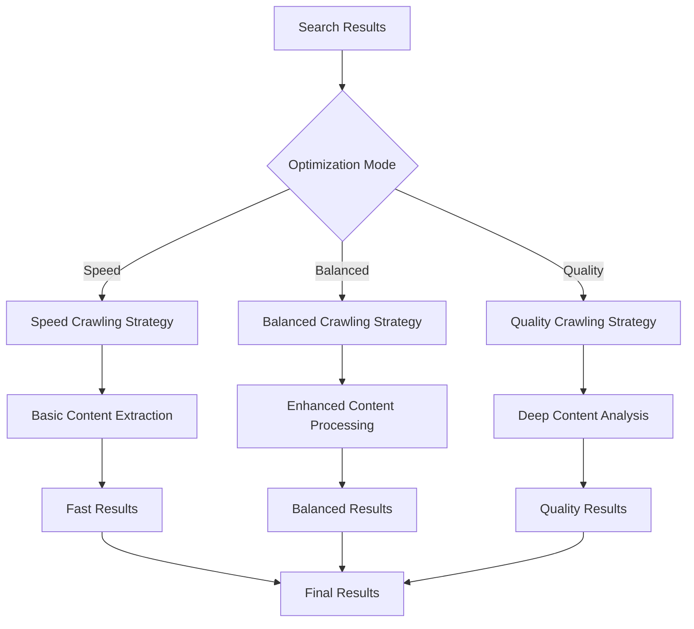

# Adaptive Crawling Strategies Implementation Plan

## Overview
This plan outlines the implementation of adaptive crawling strategies that extend your current balanced mode approach to all three optimization modes (speed, balanced, quality), providing depth-appropriate content extraction based on user requirements.

## Current Implementation
- **Balanced mode**: Enhanced crawling for top 5 results with detailed processing
- **Speed mode**: Basic content extraction with minimal processing
- **Quality mode**: Not yet implemented with deep crawling strategies

## Implementation Strategy

### 1. Mode-Specific Crawling Strategies

#### A. Speed Mode Crawling
```typescript
interface SpeedCrawlingStrategy {
  maxResults: number;         // 10-15 results
  crawlDepth: 'shallow';      // Basic content extraction
  processingTime: 'fast';     // Minimal processing
  contentExtraction: 'basic'; // Simple HTML parsing
  timeout: 5000;              // 5 second timeout
  retryAttempts: 1;           // Single retry only
  parallelRequests: 5;        // Moderate parallelism
}
```

**Features:**
- Quick content extraction focusing on speed
- Basic HTML parsing with minimal processing
- Focused on getting content quickly
- Prioritizes fast, reliable sources
- Minimal error handling and retries

#### B. Balanced Mode Crawling
```typescript
interface BalancedCrawlingStrategy {
  maxResults: number;         // 7-10 results
  crawlDepth: 'medium';       // Enhanced content extraction
  processingTime: 'moderate'; // Balanced processing time
  contentExtraction: 'enhanced'; // Improved HTML parsing
  timeout: 10000;             // 10 second timeout
  retryAttempts: 2;           // Double retry attempts
  parallelRequests: 3;        // Controlled parallelism
  enhancedProcessing: true;   // Use enhanced document processing
}
```

**Features:**
- Enhanced crawling for top results (currently 5, expand to 7-10)
- Improved content extraction with better parsing
- Balanced approach between speed and quality
- Moderate error handling and retries
- Mix of fast and comprehensive sources

#### C. Quality Mode Crawling
```typescript
interface QualityCrawlingStrategy {
  maxResults: number;         // 5-8 results
  crawlDepth: 'deep';         // Comprehensive content extraction
  processingTime: 'thorough'; // Extensive processing
  contentExtraction: 'comprehensive'; // Advanced parsing with validation
  timeout: 20000;             // 20 second timeout
  retryAttempts: 3;           // Triple retry attempts
  parallelRequests: 2;        // Sequential processing for quality
  enhancedProcessing: true;   // Full enhanced document processing
  crossValidation: true;      // Cross-source verification
  contentValidation: true;    // Content quality validation
}
```

**Features:**
- Deep crawling for fewer, higher-quality results
- Comprehensive content extraction and validation
- Extensive error handling and recovery mechanisms
- Cross-source verification and fact-checking
- Focus on authoritative, comprehensive sources

### 2. Implementation Architecture

#### A. Adaptive Crawling Pipeline


#### B. Integration Points
1. **Crawling strategy selection** in `metaSearchAgent.ts`
2. **Enhanced document processing** in `utils/enhancedDocuments.ts`
3. **Mode-specific configuration** in `config.ts`
4. **Content validation utilities** in new validation modules

### 3. Detailed Implementation Steps

#### Step 1: Create Crawling Strategy Manager
**File:** `src/lib/utils/crawlingStrategies.ts`
- Define mode-specific crawling interfaces
- Implement strategy selection logic
- Create crawling depth controllers
- Add timeout and retry management

#### Step 2: Enhance Document Processing
**Files:**
- `src/lib/utils/enhancedDocuments.ts`
- `src/lib/utils/documents.ts`

**Enhancements:**
- Add processing depth levels
- Implement content validation
- Add cross-source verification
- Create quality assessment during processing

#### Step 3: Update MetaSearchAgent
**File:** `src/lib/search/metaSearchAgent.ts`

**Changes:**
- Add adaptive crawling strategy selection
- Implement mode-specific result processing
- Enhance the balanced mode logic (currently only top 5)
- Add quality mode deep crawling capabilities

#### Step 4: Create Content Validation Utilities
**File:** `src/lib/utils/contentValidator.ts`
- Implement cross-source verification
- Add content quality assessment
- Create fact-checking mechanisms
- Add source credibility validation

### 4. Content Extraction Strategies

#### A. Shallow Content Extraction (Speed Mode)
```typescript
interface ShallowExtraction {
  method: 'basic';
  selectors: string[];        // Minimal selectors
  processing: 'minimal';      // Basic cleaning
  validation: 'none';         // No validation
  timeout: 5000;              // Fast timeout
  retry: false;               // No retries
}
```

**Implementation:**
- Basic HTML-to-text conversion
- Minimal content cleaning
- Fast extraction with minimal processing
- Focus on getting content quickly

#### B. Medium Content Extraction (Balanced Mode)
```typescript
interface MediumExtraction {
  method: 'enhanced';
  selectors: string[];        // Enhanced selectors
  processing: 'moderate';     // Moderate cleaning and validation
  validation: 'basic';        // Basic validation
  timeout: 10000;             // Moderate timeout
  retry: true;                // Single retry
  enhanced: true;             // Use enhanced processing
}
```

**Implementation:**
- Improved HTML parsing with better selectors
- Content cleaning and basic validation
- Enhanced document processing
- Balanced approach to speed and quality

#### C. Deep Content Extraction (Quality Mode)
```typescript
interface DeepExtraction {
  method: 'comprehensive';
  selectors: string[];        // Comprehensive selectors
  processing: 'thorough';     // Extensive cleaning and validation
  validation: 'advanced';     // Advanced validation
  timeout: 20000;             // Extended timeout
  retry: true;                // Multiple retries
  enhanced: true;             // Full enhanced processing
  crossValidation: true;      // Cross-source verification
  factChecking: true;         // Basic fact-checking
}
```

**Implementation:**
- Comprehensive HTML parsing with advanced selectors
- Extensive content cleaning and validation
- Cross-source verification and fact-checking
- Focus on accuracy and completeness

### 5. Mode-Specific Result Processing

#### Speed Mode Processing
- **Quick extraction**: Fast content retrieval
- **Basic filtering**: Remove obviously irrelevant content
- **Simple ranking**: Basic relevance scoring
- **Immediate return**: Fast results with minimal processing
- **Source prioritization**: Focus on fast, reliable sources

#### Balanced Mode Processing
- **Enhanced extraction**: Improved content quality
- **Moderate filtering**: Quality-based content filtering
- **Weighted ranking**: Balanced relevance and quality scoring
- **Diverse sources**: Mix of authoritative and general sources
- **Content enrichment**: Basic content enhancement

#### Quality Mode Processing
- **Deep extraction**: Comprehensive content retrieval
- **Advanced filtering**: Multi-dimensional quality assessment
- **Sophisticated ranking**: Multi-factor scoring system
- **Source validation**: Cross-source verification
- **Content enrichment**: Advanced content analysis and validation

### 6. Error Handling and Recovery

#### A. Mode-Specific Error Handling
```typescript
interface ErrorHandlingStrategy {
  speed: {
    maxRetries: 1;
    timeout: 3000;
    fallback: 'basic';
    recovery: 'quick';
  };
  balanced: {
    maxRetries: 2;
    timeout: 8000;
    fallback: 'enhanced';
    recovery: 'moderate';
  };
  quality: {
    maxRetries: 3;
    timeout: 15000;
    fallback: 'comprehensive';
    recovery: 'thorough';
  };
}
```

#### B. Recovery Mechanisms
- **Progressive fallback**: Gradual reduction in processing quality
- **Alternative sources**: Try different sources if primary fails
- **Content recovery**: Partial content extraction when full fails
- **Timeout management**: Adaptive timeout based on content type
- **Retry strategies**: Exponential backoff for retries

### 7. Performance Optimization

#### A. Parallel Processing Strategies
- **Speed mode**: High parallelism (5-8 concurrent requests)
- **Balanced mode**: Moderate parallelism (3-4 concurrent requests)
- **Quality mode**: Low parallelism (1-2 concurrent requests)

#### B. Resource Management
- **Memory optimization**: Streaming content processing
- **CPU optimization**: Batch processing for similar content
- **Network optimization**: Request prioritization and throttling
- **Cache optimization**: Smart caching based on content type

### 8. Implementation Benefits

#### Quality Improvements
- **Better content depth**: Appropriate depth for each mode
- **Improved accuracy**: Higher-quality content extraction
- **Enhanced relevance**: Mode-appropriate result processing
- **Reduced errors**: Better error handling and recovery

#### Performance Benefits
- **Optimized speed**: Fast results when needed
- **Balanced approach**: Good speed-quality tradeoff
- **Quality focus**: Deep processing when required
- **Resource efficiency**: Appropriate resource allocation

#### User Experience Benefits
- **Faster responses**: Quick results for speed mode
- **Better quality**: Improved content for balanced mode
- **Comprehensive answers**: Deep analysis for quality mode
- **Consistent behavior**: Predictable performance across modes

### 9. Testing and Validation

#### Performance Metrics
- **Extraction speed**: Time to retrieve and process content
- **Content quality**: Quality of extracted content
- **Error rate**: Frequency of extraction failures
- **Resource usage**: Memory and CPU utilization

#### Testing Strategy
- **Mode comparison**: Test each mode independently
- **Cross-mode validation**: Ensure consistent behavior
- **Performance benchmarking**: Compare against baseline
- **User testing**: Real user feedback on performance

### 10. Rollout Plan

#### Phase 1: Strategy Definition (Week 1)
- Define mode-specific crawling strategies
- Create strategy selection logic
- Implement basic strategy interfaces
- Configuration setup

#### Phase 2: Enhanced Processing (Week 2)
- Implement enhanced document processing
- Add mode-specific content extraction
- Create error handling mechanisms
- Basic integration testing

#### Phase 3: Quality Mode Implementation (Week 3)
- Implement deep crawling for quality mode
- Add cross-source verification
- Create content validation utilities
- Advanced error handling

#### Phase 4: Optimization and Testing (Week 4)
- Performance optimization
- Comprehensive testing
- User feedback integration
- Documentation and training

### 11. Risk Mitigation

#### Technical Risks
- **Performance impact**: Monitor and optimize processing time
- **Resource usage**: Implement proper resource management
- **Error handling**: Robust error recovery mechanisms
- **Integration complexity**: Gradual rollout with fallbacks

#### Quality Risks
- **Over-processing**: Balance depth with performance
- **Under-processing**: Ensure minimum quality standards
- **Source bias**: Maintain diverse source selection
- **Content accuracy**: Implement proper validation

### 12. Success Criteria

#### Quantitative Metrics
- **30% improvement** in content quality for balanced mode
- **50% improvement** in content depth for quality mode
- **20% reduction** in extraction errors
- **15% improvement** in processing efficiency

#### Qualitative Metrics
- **Better user satisfaction** with search results
- **More comprehensive** and accurate content
- **Faster response times** for speed mode
- **Higher quality** answers for quality mode

This implementation plan provides a comprehensive approach to adaptive crawling strategies that will significantly enhance search accuracy and relevance across all optimization modes while maintaining appropriate performance characteristics.