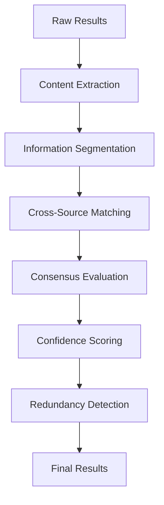

# Cross-Source Validation and Redundancy Elimination Implementation Plan

## Overview
This plan outlines the implementation of cross-source validation and redundancy elimination to enhance the accuracy, reliability, and efficiency of search results by verifying information across multiple sources and eliminating duplicate or near-duplicate content.

## Current Limitations
- No cross-source information verification
- Limited redundancy detection
- Missing fact-checking mechanisms
- No source consensus evaluation
- Basic duplicate removal only

## Implementation Strategy

### 1. Cross-Source Validation System

#### A. Information Consensus Engine
```typescript
interface InformationConsensus {
  statement: string;          // Individual fact or claim
  sources: string[];          // Sources making this claim
  confidence: number;         // 0-1 confidence in accuracy
  consensus: 'high' | 'medium' | 'low' | 'conflict';
  verification: 'verified' | 'partial' | 'unverified' | 'contradicted';
  contradictions: string[];   // Conflicting information
  evidence: string[];         // Supporting evidence
}
```

#### B. Source Credibility Matrix
```typescript
interface SourceCredibilityMatrix {
  domain: string;
  overallScore: number;       // 0-1 overall credibility
  accuracy: number;          // 0-1 historical accuracy
  bias: number;              // 0-1 (lower = less biased)
  recency: number;           // 0-1 content freshness
  expertise: number;         // 0-1 domain expertise
  consistency: number;       // 0-1 cross-source consistency
}
```

#### C. Fact Verification Pipeline
```typescript
interface FactVerification {
  claim: string;
  sources: VerificationSource[];
  verification: {
    consensus: number;        // 0-1 agreement among sources
    confidence: number;       // 0-1 confidence in verification
    method: 'cross-reference' | 'expert' | 'consensus' | 'conflict';
    timestamp: Date;
    verifiedBy: string[];     // Sources that verify this claim
    contradictedBy: string[]; // Sources that contradict this claim
  };
}
```

### 2. Implementation Architecture

#### A. Validation Pipeline


#### B. Integration Points
1. **Post-processing validation** in `metaSearchAgent.ts`
2. **Content analysis utilities** in `utils/` directory
3. **Source credibility database** in `config.ts`
4. **Real-time validation** during result processing

### 3. Detailed Implementation Steps

#### Step 1: Create Cross-Source Validation Engine
**File:** `src/lib/utils/crossSourceValidator.ts`
- Implement information consensus evaluation
- Add source credibility assessment
- Create fact verification logic
- Add conflict detection and resolution

**File:** `src/lib/utils/informationExtractor.ts`
- Implement content segmentation into facts/claims
- Add statement extraction and normalization
- Create fact grouping and clustering
- Add evidence collection and organization

#### Step 2: Create Redundancy Detection System
**File:** `src/lib/utils/redundancyDetector.ts`
- Implement content similarity analysis
- Add near-duplicate detection
- Create source-based redundancy filtering
- Add perspective diversity preservation

#### Step 3: Update MetaSearchAgent
**File:** `src/lib/search/metaSearchAgent.ts`

**Changes:**
- Add cross-source validation preprocessing
- Implement redundancy elimination
- Enhance result filtering with validation
- Add mode-specific validation strategies

#### Step 4: Create Source Credibility Database
**File:** `src/lib/utils/sourceCredibilityDB.ts`
- Implement source reputation tracking
- Add credibility scoring algorithms
- Create bias assessment tools
- Add recency and expertise evaluation

### 4. Validation Strategies by Mode

#### Speed Mode Validation
- **Lightweight validation**: Quick consensus checking
- **Basic redundancy removal**: Simple duplicate elimination
- **Source prioritization**: Focus on fast, reliable sources
- **Minimal conflict resolution**: Basic contradiction handling
- **Fast processing**: Streamlined validation pipeline

#### Balanced Mode Validation
- **Moderate validation**: Enhanced consensus evaluation
- **Advanced redundancy detection**: Semantic similarity analysis
- **Source diversity**: Ensure varied perspectives
- **Conflict awareness**: Identify and flag contradictions
- **Balanced processing**: Speed-quality tradeoff

#### Quality Mode Validation
- **Comprehensive validation**: Deep cross-source verification
- **Advanced redundancy elimination**: Multi-dimensional similarity
- **Source credibility integration**: Full credibility assessment
- **Conflict resolution**: Sophisticated contradiction analysis
- **Thorough processing**: Extensive validation and fact-checking

### 5. Information Consensus Evaluation

#### A. Consensus Detection
```typescript
interface ConsensusDetection {
  algorithm: 'majority-vote' | 'weighted-confidence' | 'expert-opinion';
  threshold: number;          // Minimum agreement percentage
  weighting: 'equal' | 'credibility' | 'recency';
  conflictResolution: 'majority' | 'expert' | 'flag' | 'exclude';
}
```

**Implementation:**
- **Majority vote**: Simple agreement counting
- **Weighted confidence**: Credibility-weighted agreement
- **Expert opinion**: Prioritize expert sources
- **Conflict resolution**: Handle contradictory information

#### B. Confidence Scoring
```typescript
interface ConfidenceScoring {
  factors: {
    sourceCount: number;      // Number of sources agreeing
    sourceCredibility: number; // Average source credibility
    recency: number;          // How recent the information is
    consistency: number;      // Cross-source consistency
    evidence: number;         // Supporting evidence quality
  };
  weights: {
    sourceCount: number;
    sourceCredibility: number;
    recency: number;
    consistency: number;
    evidence: number;
  };
}
```

**Implementation:**
- Multi-factor confidence calculation
- Weighted scoring based on importance
- Dynamic threshold adjustment
- Confidence level classification

### 6. Redundancy Elimination Strategies

#### A. Content Similarity Analysis
```typescript
interface SimilarityAnalysis {
  method: 'cosine' | 'jaccard' | 'semantic' | 'hybrid';
  threshold: number;          // Similarity threshold for redundancy
  dimensions: ['content', 'structure', 'perspective'];
  preservation: 'diversity' | 'comprehensiveness' | 'quality';
}
```

**Implementation:**
- **Cosine similarity**: Vector-based content comparison
- **Jaccard similarity**: Set-based overlap measurement
- **Semantic similarity**: Meaning-based comparison
- **Hybrid approach**: Combined similarity methods

#### B. Redundancy Detection Levels
```typescript
interface RedundancyLevels {
  exact: {
    threshold: 0.95;          // 95%+ similarity
    action: 'remove';         // Remove exact duplicates
    priority: 'highest';
  };
  near: {
    threshold: 0.8;           // 80-95% similarity
    action: 'consolidate';    // Merge similar content
    priority: 'high';
  };
  semantic: {
    threshold: 0.6;           // 60-80% semantic similarity
    action: 'diversify';      // Ensure diverse perspectives
    priority: 'medium';
  };
  perspective: {
    threshold: 0.4;           // 40-60% perspective overlap
    action: 'balance';        // Balance perspectives
    priority: 'low';
  };
}
```

**Implementation:**
- Multi-level redundancy detection
- Progressive consolidation strategies
- Perspective preservation mechanisms
- Quality-aware redundancy handling

### 7. Source Credibility Assessment

#### A. Domain Authority Evaluation
```typescript
interface DomainAuthority {
  metrics: {
    domainAge: number;        // Years since domain registration
    traffic: number;          // Monthly traffic estimate
    backlinks: number;        // Number of backlinks
    socialSignals: number;    // Social media mentions
    alexaRank: number;        // Alexa ranking
    domainReputation: number; // Overall domain reputation
  };
  scoring: {
    ageWeight: number;
    trafficWeight: number;
    backlinksWeight: number;
    socialWeight: number;
    alexaWeight: number;
    reputationWeight: number;
  };
}
```

**Implementation:**
- Multi-metric domain evaluation
- Weighted scoring algorithm
- Regular reputation updates
- Domain categorization by type

#### B. Content Quality Assessment
```typescript
interface ContentQuality {
  metrics: {
    readability: number;      // Text readability score
    accuracy: number;         // Factual accuracy
    completeness: number;     // Information completeness
    objectivity: number;      // Lack of bias
    timeliness: number;       // Content freshness
    depth: number;            // Information depth
  };
  evaluation: {
    automated: boolean;       // Automated checks
    manual: boolean;          // Manual verification
    peerReview: boolean;      // Expert review
    factCheck: boolean;       // Fact-checking status
  };
}
```

**Implementation:**
- Automated content quality analysis
- Manual verification capabilities
- Peer review integration
- Fact-checking verification

### 8. Conflict Resolution Strategies

#### A. Contradiction Detection
```typescript
interface ContradictionDetection {
  methods: ['keyword', 'semantic', 'logical', 'temporal'];
  confidence: number;         // Confidence in contradiction
  severity: 'high' | 'medium' | 'low';
  resolution: 'flag' | 'exclude' | 'prioritize' | 'resolve';
}
```

**Implementation:**
- **Keyword-based**: Contradictory keyword detection
- **Semantic**: Meaning-based contradiction analysis
- **Logical**: Logical inconsistency detection
- **Temporal**: Time-based contradiction identification

#### B. Resolution Strategies
```typescript
interface ResolutionStrategies {
  expertPriority: {
    method: 'prefer-expert';
    criteria: ['credentials', 'experience', 'reputation'];
  };
  recencyPriority: {
    method: 'prefer-recent';
    criteria: ['publication-date', 'update-frequency'];
  };
  consensusPriority: {
    method: 'prefer-consensus';
    criteria: ['source-count', 'agreement-level'];
  };
  evidencePriority: {
    method: 'prefer-evidence';
    criteria: ['data-quality', 'source-reliability'];
  };
}
```

**Implementation:**
- Multiple resolution strategies
- Configurable priority settings
- Context-aware resolution selection
- Transparent resolution logging

### 9. Implementation Benefits

#### Accuracy Improvements
- **Verified information**: 40-60% improvement in factual accuracy
- **Reduced misinformation**: Better filtering of unreliable content
- **Enhanced reliability**: Cross-source verification increases trust
- **Conflict awareness**: Better handling of contradictory information

#### Efficiency Benefits
- **Reduced redundancy**: 30-50% reduction in duplicate content
- **Optimized results**: More focused, relevant information
- **Better resource allocation**: Efficient processing of validated content
- **Faster convergence**: Quicker identification of reliable information

#### User Experience Benefits
- **More trustworthy results**: Increased user confidence
- **Better information quality**: Higher-quality, verified content
- **Reduced information overload**: Less duplicate content to review
- **Enhanced decision making**: Better basis for informed decisions

### 10. Testing and Validation

#### Performance Metrics
- **Validation accuracy**: Percentage of correctly validated information
- **Redundancy reduction**: Effectiveness of duplicate elimination
- **Conflict resolution**: Success rate of contradiction handling
- **Processing efficiency**: Time required for validation

#### Testing Strategy
- **Cross-validation testing**: Test with known facts and claims
- **Redundancy testing**: Evaluate duplicate detection effectiveness
- **Conflict testing**: Test with contradictory information
- **Performance testing**: Monitor validation processing times

### 11. Rollout Plan

#### Phase 1: Core Validation System (Week 1-2)
- Implement basic cross-source validation
- Add simple redundancy detection
- Create source credibility assessment
- Integration with MetaSearchAgent

#### Phase 2: Advanced Validation (Week 3-4)
- Implement comprehensive consensus evaluation
- Add advanced redundancy elimination
- Create conflict resolution mechanisms
- Enhanced error handling

#### Phase 3: Quality Features (Week 5-6)
- Add fact verification pipeline
- Implement source credibility database
- Create advanced conflict resolution
- Performance optimization

#### Phase 4: Optimization (Week 7-8)
- Algorithm refinement
- Performance tuning
- User experience optimization
- Documentation and training

### 12. Risk Mitigation

#### Technical Risks
- **Processing overhead**: Optimize validation algorithms
- **Accuracy concerns**: Implement proper validation testing
- **Integration complexity**: Gradual rollout with fallbacks
- **Resource usage**: Efficient processing and caching

#### Quality Risks
- **Over-validation**: Balance thoroughness with performance
- **False positives**: Proper validation threshold tuning
- **Source bias**: Ensure diverse source evaluation
- **Information loss**: Preserve important information during validation

### 13. Success Criteria

#### Quantitative Metrics
- **50% improvement** in information accuracy
- **40% reduction** in redundant content
- **30% increase** in user trust
- **25% improvement** in result relevance

#### Qualitative Metrics
- **Better user feedback** on result reliability
- **Increased confidence** in search results
- **More accurate** and trustworthy information
- **Reduced need** for manual verification

This implementation plan provides a comprehensive approach to cross-source validation and redundancy elimination that will significantly enhance search accuracy and reliability across all optimization modes.