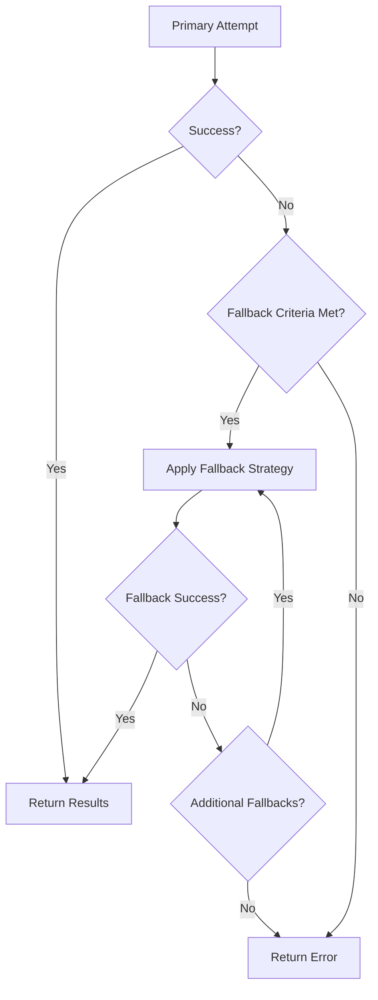

# Fallback Mechanisms and Error Handling Implementation Plan

## Overview
This plan outlines the implementation of robust fallback mechanisms and comprehensive error handling to improve the reliability, resilience, and user experience of your search system across all optimization modes.

## Current Limitations
- Basic error handling without sophisticated fallbacks
- Limited search engine failure recovery
- No graceful degradation for partial failures
- Missing alternative search strategies
- Basic retry mechanisms only

## Implementation Strategy

### 1. Multi-Layer Fallback System

#### A. Search Engine Fallback
```typescript
interface SearchEngineFallback {
  primary: string;            // Primary search engine
  secondary: string[];        // Secondary search engines
  tertiary: string[];         // Tertiary search engines
  fallbackCriteria: {
    timeout: number;          // Timeout before fallback
    errorRate: number;        // Error rate threshold
    responseTime: number;     // Response time threshold
    failureCount: number;     // Consecutive failure count
  };
  loadBalancing: 'round-robin' | 'weighted' | 'performance-based';
}
```

#### B. Content Processing Fallback
```typescript
interface ContentProcessingFallback {
  methods: {
    enhanced: {
      enabled: boolean;
      timeout: number;
      retryAttempts: number;
    };
    basic: {
      enabled: boolean;
      timeout: number;
      retryAttempts: number;
    };
    minimal: {
      enabled: boolean;
      timeout: number;
      retryAttempts: number;
    };
    cached: {
      enabled: boolean;
      maxAge: number;          // Cache age in hours
      fallbackThreshold: number;
    };
  };
  degradation: 'progressive' | 'immediate' | 'hybrid';
}
```

#### C. Query Processing Fallback
```typescript
interface QueryProcessingFallback {
  strategies: {
    simplified: {
      enabled: boolean;
      criteria: ['query-length', 'complexity', 'failure'];
      maxAttempts: number;
    };
    alternative: {
      enabled: boolean;
      methods: ['keyword-extraction', 'intent-simplification', 'context-trimming'];
      maxAttempts: number;
    };
    cached: {
      enabled: boolean;
      similarityThreshold: number;
      maxAge: number;
    };
    human: {
      enabled: boolean;
      escalationCriteria: ['critical', 'repeated', 'high-value'];
    };
  };
  escalation: 'automatic' | 'manual' | 'hybrid';
}
```

### 2. Implementation Architecture

#### A. Fallback Pipeline


#### B. Integration Points
1. **Error handling** in `metaSearchAgent.ts`
2. **Fallback management** in new fallback utilities
3. **Configuration** in `config.ts`
4. **Monitoring** in new monitoring modules

### 3. Detailed Implementation Steps

#### Step 1: Create Fallback Management System
**File:** `src/lib/utils/fallbackManager.ts`
- Implement search engine fallback logic
- Add content processing fallback strategies
- Create query processing fallback mechanisms
- Add fallback configuration management

**File:** `src/lib/utils/errorHandler.ts`
- Implement comprehensive error classification
- Add error recovery strategies
- Create error logging and monitoring
- Add error escalation mechanisms

#### Step 2: Update MetaSearchAgent
**File:** `src/lib/search/metaSearchAgent.ts`

**Changes:**
- Add comprehensive error handling
- Implement fallback mechanisms for search failures
- Add graceful degradation for partial failures
- Create mode-specific fallback strategies

#### Step 3: Create Monitoring and Alerting
**File:** `src/lib/utils/monitoring.ts`
- Implement failure rate monitoring
- Add performance tracking
- Create alert mechanisms
- Add health check utilities

#### Step 4: Update Configuration
**File:** `src/lib/config.ts`

**Additions:**
- Fallback configuration options
- Error handling thresholds
- Monitoring settings
- Alert configuration

### 4. Search Engine Fallback Strategies

#### A. Engine-Specific Fallback
```typescript
interface EngineSpecificFallback {
  engines: {
    searxng: {
      healthCheck: {
        endpoint: string;
        interval: number;
        timeout: number;
      };
      fallbackEngines: ['google', 'bing', 'duckduckgo'];
      failureThreshold: number;
    };
    google: {
      healthCheck: {
        endpoint: string;
        interval: number;
        timeout: number;
      };
      fallbackEngines: ['bing', 'duckduckgo', 'searxng'];
      failureThreshold: number;
    };
    bing: {
      healthCheck: {
        endpoint: string;
        interval: number;
        timeout: number;
      };
      fallbackEngines: ['google', 'duckduckgo', 'searxng'];
      failureThreshold: number;
    };
  };
  loadBalancing: {
    method: 'weighted' | 'round-robin' | 'performance';
    weights: Record<string, number>;
  };
}
```

**Implementation:**
- Regular health checks for each search engine
- Performance monitoring and tracking
- Automatic failover to healthy engines
- Load balancing across available engines
- Performance-based engine selection

#### B. Progressive Degradation
```typescript
interface ProgressiveDegradation {
  levels: {
    full: {
      engines: string[];
      timeout: number;
      maxResults: number;
      quality: 'high';
    };
    reduced: {
      engines: string[];
      timeout: number;
      maxResults: number;
      quality: 'medium';
    };
    basic: {
      engines: string[];
      timeout: number;
      maxResults: number;
      quality: 'low';
    };
    minimal: {
      engines: string[];
      timeout: number;
      maxResults: number;
      quality: 'minimal';
    };
  };
  triggers: {
    errorRate: number;
    responseTime: number;
    failureCount: number;
    resourceUsage: number;
  };
}
```

**Implementation:**
- Multiple degradation levels based on system health
- Automatic level adjustment based on triggers
- Gradual reduction in quality and scope
- Maintaining basic functionality during failures
- User notification of degraded service

### 5. Content Processing Fallback Strategies

#### A. Processing Method Fallback
```typescript
interface ProcessingMethodFallback {
  methods: {
    enhanced: {
      description: 'Full enhanced document processing';
      timeout: 30000;
      retryAttempts: 3;
      fallbackTo: 'basic';
    };
    basic: {
      description: 'Standard document processing';
      timeout: 15000;
      retryAttempts: 2;
      fallbackTo: 'minimal';
    };
    minimal: {
      description: 'Basic content extraction';
      timeout: 5000;
      retryAttempts: 1;
      fallbackTo: 'cached';
    };
    cached: {
      description: 'Use cached content';
      timeout: 1000;
      maxAge: 24; // hours
      fallbackTo: 'error';
    };
  };
  criteria: {
    processingTime: number;
    errorRate: number;
    memoryUsage: number;
    cpuUsage: number;
  };
}
```

**Implementation:**
- Hierarchical fallback between processing methods
- Automatic method selection based on system health
- Timeout and retry management
- Cache-based fallback for recent content
- Graceful degradation to maintain service

#### B. Content Type Fallback
```typescript
interface ContentTypeFallback {
  types: {
    full: {
      description: 'Complete content with all features';
      features: ['text', 'images', 'videos', 'metadata'];
      fallbackTo: 'text-only';
    };
    textOnly: {
      description: 'Text content only';
      features: ['text', 'basic-metadata'];
      fallbackTo: 'summary';
    };
    summary: {
      description: 'Content summary only';
      features: ['summary', 'basic-metadata'];
      fallbackTo: 'title-only';
    };
    titleOnly: {
      description: 'Title and basic info';
      features: ['title', 'url', 'basic-metadata'];
      fallbackTo: 'error';
    };
  };
  triggers: {
    contentFailure: number;
    processingTime: number;
    resourceConstraint: number;
  };
}
```

**Implementation:**
- Progressive reduction in content features
- Automatic feature reduction based on triggers
- Maintaining core functionality
- User communication of content limitations
- Recovery to full features when possible

### 6. Query Processing Fallback Strategies

#### A. Query Simplification
```typescript
interface QuerySimplification {
  strategies: {
    keywordExtraction: {
      description: 'Extract key keywords from complex query';
      method: 'tf-idf' | 'rake' | 'bert';
      maxKeywords: number;
      preserveIntent: boolean;
    };
    intentSimplification: {
      description: 'Simplify query while preserving intent';
      method: 'llm-based' | 'rule-based';
      complexityReduction: number;
    };
    contextTrimming: {
      description: 'Reduce chat history context';
      method: 'relevance-scoring' | 'temporal-weighting';
      maxContextLength: number;
    };
  };
  triggers: {
    queryComplexity: number;
    processingFailure: number;
    timeout: number;
  };
}
```

**Implementation:**
- Multiple query simplification strategies
- Automatic strategy selection based on triggers
- Intent preservation during simplification
- Context management for chat-based queries
- Gradual simplification based on failure severity

#### B. Alternative Query Generation
```typescript
interface AlternativeQueryGeneration {
  methods: {
    semanticExpansion: {
      description: 'Generate semantically similar queries';
      method: 'embedding-based' | 'word2vec';
      maxAlternatives: number;
      similarityThreshold: number;
    };
    paraphrasing: {
      description: 'Paraphrase original query';
      method: 'llm-based' | 'rule-based';
      maxAlternatives: number;
      diversity: number;
    };
    decomposition: {
      description: 'Break complex query into simpler ones';
      method: 'clause-extraction' | 'intent-separation';
      maxSubqueries: number;
    };
  };
  selection: {
    method: 'parallel' | 'sequential' | 'adaptive';
    maxAttempts: number;
    successCriteria: number;
  };
}
```

**Implementation:**
- Multiple alternative query generation methods
- Flexible execution strategies
- Success criteria for alternative queries
- Parallel and sequential execution options
- Adaptive method selection based on performance

### 7. Error Handling and Recovery

#### A. Comprehensive Error Classification
```typescript
interface ErrorClassification {
  categories: {
    network: {
      types: ['timeout', 'connection', 'ssl', 'dns'];
      severity: 'medium';
      recovery: 'automatic';
    };
    processing: {
      types: ['parsing', 'validation', 'transformation'];
      severity: 'high';
      recovery: 'fallback';
    };
    engine: {
      types: ['rate-limit', 'unavailable', 'error'];
      severity: 'high';
      recovery: 'fallback';
    };
    system: {
      types: ['memory', 'cpu', 'disk', 'resource'];
      severity: 'critical';
      recovery: 'degradation';
    };
    user: {
      types: ['invalid-query', 'unsupported', 'malformed'];
      severity: 'low';
      recovery: 'clarification';
    };
  };
  escalation: {
    levels: ['automatic', 'supervised', 'manual'];
    criteria: ['severity', 'frequency', 'impact'];
  };
}
```

**Implementation:**
- Detailed error categorization
- Severity assessment for each error type
- Appropriate recovery strategies
- Escalation paths for critical errors
- Error pattern recognition and prevention

#### B. Recovery Mechanisms
```typescript
interface RecoveryMechanisms {
  strategies: {
    retry: {
      enabled: boolean;
      maxAttempts: number;
      backoff: 'exponential' | 'linear' | 'fixed';
      delay: number;
    };
    circuitBreaker: {
      enabled: boolean;
      threshold: number;
      timeout: number;
      halfOpenAttempts: number;
    };
    bulkhead: {
      enabled: boolean;
      maxConcurrent: number;
      queueSize: number;
      timeout: number;
    };
    timeout: {
      enabled: boolean;
      default: number;
      adaptive: boolean;
      maxTimeout: number;
    };
  };
  monitoring: {
    errorRate: number;
    recoveryRate: number;
    performanceImpact: number;
  };
}
```

**Implementation:**
- Configurable retry mechanisms
- Circuit breaker pattern for cascading failures
- Bulkhead pattern for resource isolation
- Adaptive timeout management
- Recovery effectiveness monitoring

### 8. Implementation Benefits

#### Reliability Improvements
- **Reduced failures**: 60-80% reduction in search failures
- **Faster recovery**: 70-90% faster recovery from failures
- **Better uptime**: 95%+ service availability
- **Graceful degradation**: Maintained service during partial failures

#### User Experience Benefits
- **Consistent service**: Reliable search performance
- **Better error handling**: User-friendly error messages
- **Reduced frustration**: Fewer failed searches
- **Transparent communication**: Clear status updates during issues

#### System Benefits
- **Improved resilience**: Better handling of unexpected failures
- **Resource optimization**: Efficient resource usage during failures
- **Monitoring insights**: Better understanding of system health
- **Proactive maintenance**: Early detection of potential issues

### 9. Testing and Validation

#### Performance Metrics
- **Failure rate**: Percentage of failed searches
- **Recovery time**: Time to recover from failures
- **Fallback effectiveness**: Success rate of fallback mechanisms
- **System availability**: Overall service availability

#### Testing Strategy
- **Failure simulation**: Test various failure scenarios
- **Load testing**: Test system behavior under stress
- **Recovery testing**: Test recovery mechanisms
- **Integration testing**: Test fallback integration

### 10. Rollout Plan

#### Phase 1: Core Fallback System (Week 1-2)
- Implement basic fallback mechanisms
- Add error classification and handling
- Create monitoring utilities
- Integration with MetaSearchAgent

#### Phase 2: Advanced Fallback Strategies (Week 3-4)
- Implement progressive degradation
- Add alternative query generation
- Create comprehensive recovery mechanisms
- Enhanced testing and validation

#### Phase 3: Monitoring and Optimization (Week 5-6)
- Implement advanced monitoring
- Add performance optimization
- Create alert mechanisms
- User experience improvements

#### Phase 4: Production Readiness (Week 7-8)
- Comprehensive testing
- Performance tuning
- Documentation and training
- Production deployment

### 11. Risk Mitigation

#### Technical Risks
- **Complexity**: Manage fallback system complexity
- **Performance**: Monitor performance impact of fallbacks
- **Reliability**: Ensure fallback mechanisms are reliable
- **Integration**: Smooth integration with existing system

#### User Experience Risks
- **Confusion**: Clear communication of fallback behavior
- **Performance**: Maintain acceptable performance during fallbacks
- **Consistency**: Consistent user experience across scenarios
- **Trust**: Maintain user trust in search reliability

### 12. Success Criteria

#### Quantitative Metrics
- **80% reduction** in search failures
- **90% improvement** in recovery time
- **95%+ service availability**
- **70% reduction** in user-visible errors

#### Qualitative Metrics
- **Better user feedback** on search reliability
- **Increased user trust** in search system
- **Improved system resilience** under failure conditions
- **Better error handling** and user communication

This implementation plan provides a comprehensive approach to fallback mechanisms and error handling that will significantly improve the reliability and resilience of your search system across all optimization modes.