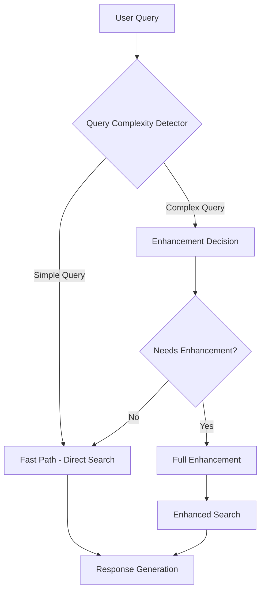

# Intelligent Query Enhancement System Design

## Problem Statement
Currently, even in Balanced mode, simple factual queries like "What is the capital of France?" take 10+ seconds because they go through the full query enhancement pipeline unnecessarily. We need an intelligent system that can detect when query enhancement is actually needed.

## Architecture Overview



## Query Complexity Detection

### Simple Queries (Fast Path - No Enhancement Needed)
**Characteristics:**
- Factual questions with clear, well-known answers
- Single-constraint questions
- Recent information requests (weather, news, stock prices)
- Definition-based questions
- "What is X?", "Who is Y?", "Where is Z?", "When did X happen?"

**Examples:**
- "What is the capital of France?"
- "Who wrote Romeo and Juliet?"
- "What is 2+2?"
- "What is the weather in London?"
- "When was the Declaration of Independence signed?"

**Detection Rules:**
1. **Question Pattern**: Starts with "what", "who", "where", "when", "which"
2. **Length**: Short queries (under 10 words)
3. **Factual Keywords**: Contains "capital", "author", "weather", "date", "definition"
4. **No Comparative Language**: No words like "best", "better", "versus", "compare"
5. **No Opinion Seeking**: No words like "think", "believe", "opinion", "should"

### Complex Queries (Enhancement Needed)
**Characteristics:**
- Multi-constraint questions
- Comparative analysis
- Opinion-seeking questions
- Research-oriented queries
- Time-sensitive analysis
- "Best X for Y based on Z" type questions

**Examples:**
- "What LLMs are best for 2025 based on latest Reddit threads?"
- "Compare GPT-4 vs Claude 3 for coding tasks"
- "What are the pros and cons of remote work?"
- "Which investment strategy performed best in 2024?"
- "How do different programming languages handle memory management?"

**Detection Rules:**
1. **Comparative Language**: Contains "vs", "compare", "better", "best", "versus"
2. **Multi-constraint**: Multiple requirements or conditions
3. **Opinion Seeking**: Contains "think", "believe", "opinion", "should", "recommend"
4. **Research-oriented**: Contains "based on", "according to", "research", "study"
5. **Time Analysis**: References time periods, trends, or historical analysis
6. **Length**: Longer queries (over 10 words) with complex structure

## Implementation Strategy

### Phase 1: Rule-Based Query Classification
1. **Pattern Matching**: Use regex patterns to identify simple vs complex queries
2. **Keyword Analysis**: Check for presence of enhancement-triggering keywords
3. **Length Analysis**: Consider query length as a complexity indicator
4. **Question Type Detection**: Classify by question words and structure

### Phase 2: Machine Learning Classification (Future Enhancement)
1. **Training Data**: Collect labeled examples of simple vs complex queries
2. **Feature Engineering**: Extract linguistic features from queries
3. **Model Selection**: Use lightweight ML model for real-time classification
4. **Continuous Learning**: Improve accuracy based on user feedback

### Phase 3: Hybrid Approach (Recommended)
1. **Rule-Based Initial Classification**: Fast initial assessment
2. **ML Validation**: Use ML to confirm classification for borderline cases
3. **Confidence Scoring**: Assign confidence levels to classifications
4. **Fallback Strategy**: Default to simple processing if uncertain

## Technical Implementation

### QueryClassifier Class
```typescript
class QueryClassifier {
  private simpleQueryPatterns: RegExp[];
  private complexQueryKeywords: string[];
  
  classify(query: string): {
    needsEnhancement: boolean;
    confidence: number;
    reason: string;
  }
}
```

### Integration Points
1. **MetaSearchAgent**: Add classification before enhancement
2. **QueryEnhancer**: Add fast path methods
3. **Configuration**: Add settings for classification sensitivity
4. **Monitoring**: Track classification accuracy and performance

### Performance Optimizations
1. **Caching**: Cache classification results for similar queries
2. **Pre-filtering**: Run lightweight classification first
3. **Parallel Processing**: Run classification alongside other operations
4. **Early Termination**: Skip enhancement for low-confidence complex queries

## Expected Performance Improvements

### Simple Queries
- **Current**: 10-50 seconds (full enhancement)
- **Target**: 2-5 seconds (fast path)
- **Improvement**: 70-90% faster response times

### Complex Queries
- **Current**: 30-60 seconds (full enhancement)
- **Target**: 25-50 seconds (enhancement only when needed)
- **Improvement**: 10-20% faster response times

### Overall System Performance
- **Average Query Time**: Reduce from 20-40 seconds to 5-15 seconds
- **User Experience**: Significantly improved response times for common queries
- **Resource Usage**: Reduced LLM calls and computational overhead

## Configuration Options

### Classification Sensitivity
- **Conservative**: Only enhance clearly complex queries
- **Balanced**: Current recommended setting
- **Aggressive**: Enhance most queries except obvious simple ones

### Fast Path Rules
- **Enable Fast Path**: Allow simple queries to bypass enhancement
- **Minimum Query Length**: Skip queries under 3 words
- **Maximum Query Length**: Always enhance queries over 50 words
- **Keyword Whitelist**: Always enhance queries containing certain keywords

### Fallback Strategy
- **Default to Simple**: If classification fails, use fast path
- **Default to Enhancement**: If classification fails, use full enhancement
- **Retry Logic**: Attempt classification again with different parameters

## Testing Strategy

### Unit Tests
1. **Query Classification**: Test classification accuracy on known examples
2. **Performance Metrics**: Measure response time improvements
3. **Edge Cases**: Test unusual query formats and edge cases

### Integration Tests
1. **End-to-End Flow**: Test complete query processing pipeline
2. **Mode Compatibility**: Ensure compatibility with Speed/Balanced/Quality modes
3. **Error Handling**: Test graceful handling of classification failures

### User Acceptance Testing
1. **Real-world Queries**: Test with actual user queries
2. **A/B Testing**: Compare performance with and without enhancement
3. **User Feedback**: Collect feedback on response quality and speed

## Rollout Plan

### Phase 1: Implementation (Week 1)
1. Develop QueryClassifier class
2. Implement rule-based classification
3. Integrate with MetaSearchAgent
4. Add configuration options

### Phase 2: Testing (Week 2)
1. Unit and integration testing
2. Performance benchmarking
3. User acceptance testing
4. Bug fixes and optimization

### Phase 3: Deployment (Week 3)
1. Gradual rollout to production
2. Monitoring and performance tracking
3. User feedback collection
4. Iterative improvements

### Phase 4: Enhancement (Ongoing)
1. Add machine learning classification
2. Improve accuracy with more training data
3. Optimize performance further
4. Add advanced features

## Success Metrics

### Performance Metrics
- **Average Response Time**: Reduce by 50-70%
- **Query Enhancement Rate**: Reduce to 30-40% of queries
- **User Satisfaction**: Improve response time satisfaction scores

### Technical Metrics
- **Classification Accuracy**: Achieve 85-90% accuracy
- **False Positive Rate**: Keep below 10%
- **System Overhead**: Add minimal computational overhead

### Business Metrics
- **User Engagement**: Increase query frequency due to faster responses
- **User Retention**: Improve retention through better performance
- **Feature Adoption**: Maintain high adoption of Balanced mode