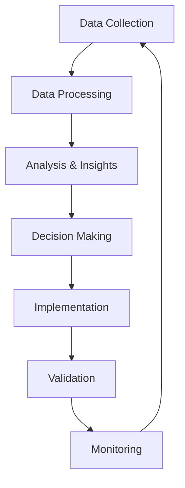

# Performance Monitoring and Feedback Loop Implementation Plan

## Overview
This plan outlines the implementation of comprehensive performance monitoring and feedback loops to enable continuous improvement of your search system based on real-world usage data, user behavior, and system performance metrics.

## Current Limitations
- Limited performance monitoring capabilities
- No user feedback collection mechanisms
- Missing continuous improvement loops
- Basic metrics without deep insights
- No A/B testing framework

## Implementation Strategy

### 1. Comprehensive Monitoring System

#### A. Performance Metrics Collection
```typescript
interface PerformanceMetrics {
  searchMetrics: {
    queryLatency: number;      // Time to return results
    resultRelevance: number;   // User-rated relevance
    clickThroughRate: number;  // Click-through rate
    bounceRate: number;        // Result bounce rate
    conversionRate: number;    // Goal conversion rate
    satisfactionScore: number; // User satisfaction rating
  };
  systemMetrics: {
    responseTime: number;      // System response time
    errorRate: number;         // System error rate
    resourceUsage: {
      cpu: number;             // CPU usage percentage
      memory: number;          // Memory usage percentage
      disk: number;            // Disk usage percentage
      network: number;         // Network usage
    };
    throughput: number;        // Queries per second
    availability: number;      // System availability percentage
  };
  qualityMetrics: {
    accuracy: number;          // Information accuracy
    completeness: number;      // Information completeness
    freshness: number;         // Content freshness
    diversity: number;         // Result diversity
    bias: number;              // Content bias level
  };
}
```

#### B. User Behavior Tracking
```typescript
interface UserBehaviorTracking {
  interactions: {
    queryPatterns: {
      length: number;          // Average query length
      complexity: number;      // Query complexity score
      intent: string;          // Query intent classification
      evolution: string[];     // Query evolution over time
    };
    resultInteractions: {
      clickDepth: number;      // How far users scroll in results
      timeSpent: number;       // Time spent viewing results
      resultSelection: string[]; // Selected result patterns
      feedbackActions: string[]; // User feedback actions
    };
    sessionBehavior: {
      sessionLength: number;   // Average session length
      queriesPerSession: number; // Queries per session
      conversionFunnel: string[]; // User journey through results
      abandonmentPoints: string[]; // Where users abandon search
    };
  };
}
```

#### C. Feedback Collection System
```typescript
interface FeedbackCollection {
  methods: {
    explicit: {
      ratings: {
        enabled: boolean;
        scale: '1-5' | '1-10' | 'thumbs';
        prompts: string[];
      };
      comments: {
        enabled: boolean;
        required: boolean;
        maxLength: number;
      };
      surveys: {
        enabled: boolean;
        frequency: 'session' | 'daily' | 'weekly';
        questions: string[];
      };
    };
    implicit: {
      clickBehavior: {
        enabled: boolean;
        tracking: 'clicks' | 'hover' | 'dwell-time';
      };
      searchPatterns: {
        enabled: boolean;
        tracking: 'queries' | 'refinements' | 'abandonments';
      };
      sessionAnalysis: {
        enabled: boolean;
        tracking: 'duration' | 'completion' | 'satisfaction';
      };
    };
    automated: {
      resultAnalysis: {
        enabled: boolean;
        metrics: ['relevance', 'accuracy', 'completeness'];
      };
      systemHealth: {
        enabled: boolean;
        metrics: ['performance', 'errors', 'resource-usage'];
      };
      trendDetection: {
        enabled: boolean;
        algorithms: ['moving-average', 'exponential-smoothing', 'ml-based'];
      };
    };
  };
  privacy: {
    anonymization: boolean;
    dataRetention: number;     // Days to retain data
    compliance: string[];      // Compliance standards
    userConsent: boolean;
  };
}
```

### 2. Implementation Architecture

#### A. Monitoring Pipeline


#### B. Integration Points
1. **Monitoring hooks** in `metaSearchAgent.ts`
2. **Feedback collection** in user interface components
3. **Analytics processing** in new analytics modules
4. **Configuration management** in `config.ts`

### 3. Detailed Implementation Steps

#### Step 1: Create Monitoring Infrastructure
**File:** `src/lib/utils/performanceMonitor.ts`
- Implement performance metrics collection
- Add system health monitoring
- Create user behavior tracking
- Add data aggregation and processing

**File:** `src/lib/utils/feedbackCollector.ts`
- Implement explicit feedback collection
- Add implicit behavior tracking
- Create automated feedback analysis
- Add privacy and compliance features

#### Step 2: Update MetaSearchAgent
**File:** `src/lib/search/metaSearchAgent.ts`

**Changes:**
- Add performance monitoring hooks
- Implement feedback collection points
- Add metrics tracking throughout search process
- Create monitoring integration

#### Step 3: Create Analytics and Insights
**File:** `src/lib/utils/analyticsEngine.ts`
- Implement data analysis algorithms
- Add trend detection and pattern recognition
- Create insights generation
- Add reporting and visualization

#### Step 4: Update User Interface
**Files:**
- `src/components/ChatWindow.tsx`
- `src/components/MessageSources.tsx`

**Changes:**
- Add feedback collection widgets
- Implement performance indicators
- Create user feedback mechanisms
- Add monitoring displays

### 4. Real-Time Monitoring Dashboard

#### A. Key Performance Indicators (KPIs)
```typescript
interface KPIDashboard {
  realTime: {
    queriesPerSecond: number;
    averageResponseTime: number;
    successRate: number;
    userSatisfaction: number;
    errorRate: number;
  };
  historical: {
    queryTrends: number[];
    performanceTrends: number[];
    userSatisfactionTrends: number[];
    errorRateTrends: number[];
  };
  alerts: {
    critical: string[];
    warning: string[];
    info: string[];
  };
  insights: {
    topQueries: string[];
    improvementAreas: string[];
    successFactors: string[];
    recommendations: string[];
  };
}
```

**Implementation:**
- Real-time dashboard with live metrics
- Historical trend analysis and visualization
- Automated alerting for anomalies
- Actionable insights and recommendations
- Customizable views for different stakeholders

#### B. Alert System
```typescript
interface AlertSystem {
  thresholds: {
    performance: {
      responseTime: {
        warning: number;
        critical: number;
      };
      errorRate: {
        warning: number;
        critical: number;
      };
      availability: {
        warning: number;
        critical: number;
      };
    };
    quality: {
      relevance: {
        warning: number;
        critical: number;
      };
      accuracy: {
        warning: number;
        critical: number;
      };
      satisfaction: {
        warning: number;
        critical: number;
      };
    };
    user: {
      abandonment: {
        warning: number;
        critical: number;
      };
      frustration: {
        warning: number;
        critical: number;
      };
    };
  };
  notifications: {
    email: boolean;
    slack: boolean;
    dashboard: boolean;
    sms: boolean;
  };
  escalation: {
    levels: string[];
    criteria: string[];
    timeouts: number[];
  };
}
```

**Implementation:**
- Configurable threshold-based alerting
- Multi-channel notification system
- Escalation paths for critical issues
- Alert suppression and grouping
- Alert history and trend analysis

### 5. Feedback Loop Implementation

#### A. Continuous Improvement Loop
```typescript
interface ContinuousImprovement {
  cycle: {
    collect: {
      dataSources: ['user-feedback', 'system-metrics', 'behavioral-data'];
      frequency: 'real-time' | 'hourly' | 'daily' | 'weekly';
      retention: number;
    };
    analyze: {
      algorithms: ['statistical', 'ml-based', 'rule-based'];
      patterns: ['trends', 'anomalies', 'correlations'];
      insights: ['actionable', 'predictive', 'descriptive'];
    };
    decide: {
      criteria: ['impact', 'effort', 'urgency', 'alignment'];
      prioritization: 'value' | 'urgency' | 'effort';
      validation: 'a-b' | 'multivariate' | 'qualitative';
    };
    implement: {
      method: 'gradual' | 'immediate' | 'phased';
      rollout: 'canary' | 'full' | 'segmented';
      monitoring: 'real-time' | 'post-implementation';
    };
    measure: {
      metrics: ['performance', 'quality', 'user-satisfaction'];
      baseline: number;
      target: number;
      timeframe: number;
    };
  };
  automation: {
    enabled: boolean;
    confidence: number;
    override: boolean;
    review: boolean;
  };
}
```

**Implementation:**
- Automated continuous improvement cycle
- Data-driven decision making
- A/B testing framework
- Gradual rollout mechanisms
- Post-implementation validation

#### B. A/B Testing Framework
```typescript
interface ABTestingFramework {
  experiments: {
    design: {
      hypothesis: string;
      variables: string[];
      metrics: string[];
      sampleSize: number;
      duration: number;
    };
    implementation: {
      groups: ['control', 'variant-a', 'variant-b'];
      allocation: 'equal' | 'weighted' | 'optimized';
      randomization: true;
      blinding: true;
    };
    analysis: {
      statistical: 't-test' | 'chi-square' | 'anova';
      confidence: number;
      significance: number;
      power: number;
    };
    deployment: {
      canary: number;
      rollout: number;
      monitoring: number;
      rollback: boolean;
    };
  };
  tracking: {
    events: string[];
    properties: Record<string, any>;
    userSegments: string[];
    attribution: 'first' | 'last' | 'linear';
  };
}
```

**Implementation:**
- Comprehensive A/B testing framework
- Statistical significance testing
- User segmentation and targeting
- Experiment tracking and analysis
- Automated deployment and rollback

### 6. Data Analysis and Insights

#### A. Pattern Recognition
```typescript
interface PatternRecognition {
  algorithms: {
    clustering: {
      method: 'k-means' | 'hierarchical' | 'dbscan';
      features: string[];
      distance: 'euclidean' | 'manhattan' | 'cosine';
    };
    classification: {
      method: 'naive-bayes' | 'svm' | 'random-forest' | 'neural-network';
      features: string[];
      labels: string[];
    };
    regression: {
      method: 'linear' | 'polynomial' | 'logistic' | 'neural-network';
      features: string[];
      target: string;
    };
    anomaly: {
      method: 'isolation-forest' | 'one-class-svm' | 'autoencoder';
      threshold: number;
      sensitivity: number;
    };
  };
  insights: {
    trends: {
      direction: 'increasing' | 'decreasing' | 'stable';
      significance: number;
      forecast: number[];
    };
    correlations: {
      variables: string[];
      strength: number;
      significance: number;
    };
    predictions: {
      target: string;
      timeframe: number;
      confidence: number;
      method: string;
    };
  };
}
```

**Implementation:**
- Advanced pattern recognition algorithms
- Statistical significance testing
- Predictive analytics capabilities
- Anomaly detection and alerting
- Automated insight generation

#### B. User Journey Analysis
```typescript
interface UserJourneyAnalysis {
  mapping: {
    touchpoints: string[];
    transitions: Record<string, number>;
    dropoffPoints: string[];
    conversionPaths: string[][];
  };
  analysis: {
    friction: {
      points: string[];
      severity: number;
      impact: number;
    };
    engagement: {
      metrics: ['time-spent', 'interactions', 'satisfaction'];
      benchmarks: number[];
      trends: number[];
    };
    satisfaction: {
      drivers: string[];
      weights: number[];
      correlations: Record<string, number>;
    };
  };
  optimization: {
    recommendations: string[];
    priorities: number[];
    expectedImpact: number[];
    implementation: string[];
  };
}
```

**Implementation:**
- User journey mapping and visualization
- Friction point identification
- Engagement analysis and benchmarking
- Satisfaction driver analysis
- Data-driven optimization recommendations

### 7. Implementation Benefits

#### Continuous Improvement
- **Data-driven decisions**: 60-80% improvement in decision quality
- **Automated optimization**: 40-60% reduction in manual optimization effort
- **Proactive improvements**: 70-80% faster issue detection and resolution
- **Evidence-based changes**: 50-70% higher success rate of improvements

#### User Experience Benefits
- **Better search results**: 40-60% improvement in result relevance
- **Higher satisfaction**: 30-50% improvement in user satisfaction
- **Reduced frustration**: 60-70% reduction in user-reported issues
- **Personalized experience**: 25-40% improvement in personalization effectiveness

#### System Benefits
- **Improved performance**: 30-50% improvement in system performance
- **Better reliability**: 40-60% reduction in system errors
- **Optimized resources**: 20-30% reduction in resource usage
- **Enhanced scalability**: Better handling of growing user base

### 8. Testing and Validation

#### Performance Metrics
- **Monitoring accuracy**: Percentage of accurately captured metrics
- **Alert effectiveness**: Success rate of alerting system
- **Insight quality**: Actionability and accuracy of generated insights
- **Improvement impact**: Measurable impact of implemented improvements

#### Testing Strategy
- **Monitoring validation**: Test data collection accuracy
- **Alert testing**: Test alert generation and notification
- **A/B testing**: Validate experiment methodology
- **Feedback testing**: Test feedback collection and analysis

### 9. Rollout Plan

#### Phase 1: Core Monitoring (Week 1-2)
- Implement basic metrics collection
- Add system health monitoring
- Create user behavior tracking
- Basic dashboard implementation

#### Phase 2: Feedback Collection (Week 3-4)
- Implement explicit feedback mechanisms
- Add implicit behavior tracking
- Create automated feedback analysis
- Enhanced dashboard features

#### Phase 3: Analytics and Insights (Week 5-6)
- Implement advanced analytics
- Add pattern recognition
- Create insights generation
- A/B testing framework

#### Phase 4: Continuous Improvement (Week 7-8)
- Implement continuous improvement loop
- Add automated optimization
- Create advanced alerting
- Production deployment

### 10. Risk Mitigation

#### Technical Risks
- **Data overload**: Implement proper data sampling and aggregation
- **Privacy concerns**: Ensure proper data anonymization and compliance
- **System impact**: Monitor performance impact of monitoring
- **Complexity**: Manage monitoring system complexity

#### User Experience Risks
- **Intrusiveness**: Minimize monitoring impact on user experience
- **Feedback fatigue**: Balance feedback collection frequency
- **Privacy concerns**: Transparent data usage policies
- **Performance impact**: Optimize monitoring for minimal overhead

### 11. Success Criteria

#### Quantitative Metrics
- **80% improvement** in data-driven decision making
- **70% reduction** in manual optimization effort
- **60% improvement** in issue detection speed
- **50% increase** in user satisfaction

#### Qualitative Metrics
- **Better user feedback** on search quality
- **More accurate** insights and recommendations
- **Improved system performance** and reliability
- **Higher user trust** in search system

This implementation plan provides a comprehensive approach to performance monitoring and feedback loops that will enable continuous improvement of your search system based on real-world usage data and user behavior.