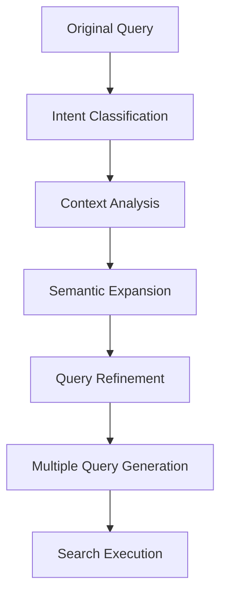

# Query Enhancement and Intent Detection Implementation Plan

## Overview
This plan outlines the implementation of query enhancement and intent detection to significantly improve search accuracy across all three optimization modes (speed, balanced, quality).

## Current Limitations
- Basic query rephrasing without semantic analysis
- No query intent classification
- Limited context-aware query refinement
- Missing semantic query expansion

## Implementation Strategy

### 1. Query Enhancement Components

#### A. Semantic Query Expansion
```typescript
interface QueryExpansion {
  originalQuery: string;
  expandedQueries: string[];
  semanticTerms: string[];
  contextTerms: string[];
}
```

**Features:**
- Use embeddings to find semantically related terms
- Extract key concepts from the query
- Generate alternative query formulations
- Maintain query intent while expanding vocabulary

#### B. Query Intent Classification
```typescript
type QueryIntent = 
  | 'factual'      // Seeking factual information
  | 'instructional' // How-to guides, tutorials
  | 'opinion'      // Seeking opinions, reviews
  | 'comparative'  // Comparing options
  | 'explanatory'  // Understanding concepts
  | 'news'         // Recent information
  | 'academic'     // Research-oriented
  | 'commercial'    // Product/service related
```

**Classification Method:**
- Analyze query keywords and structure
- Use LLM-based classification for accuracy
- Consider chat history context
- Detect urgency and specificity

#### C. Context-Aware Refinement
```typescript
interface ContextRefinement {
  refinedQuery: string;
  focusAreas: string[];
  exclusionTerms: string[];
  timeSensitivity: 'low' | 'medium' | 'high';
  sourcePreferences: string[];
}
```

**Features:**
- Leverage chat history for context
- Identify key focus areas
- Remove irrelevant terms
- Adjust for time sensitivity
- Preferred source types

### 2. Implementation Architecture

#### A. Query Enhancement Pipeline


#### B. Integration Points
1. **Pre-search processing** in `metaSearchAgent.ts`
2. **Enhanced prompt templates** in prompts directory
3. **Query scoring** for result ranking
4. **Fallback mechanism** for failed queries

### 3. Detailed Implementation Steps

#### Step 1: Create Query Enhancement Utility
**File:** `src/lib/utils/queryEnhancer.ts`
- Implement semantic query expansion
- Add intent classification
- Create context refinement logic
- Add query scoring mechanisms

#### Step 2: Update Search Prompts
**Files:** 
- `src/lib/prompts/webSearch.ts`
- `src/lib/prompts/academicSearch.ts`
- `src/lib/prompts/youtubeSearch.ts`
- `src/lib/prompts/redditSearch.ts`
- `src/lib/prompts/wolframAlpha.ts`

**Enhancements:**
- Add intent-specific instructions
- Include context-aware guidance
- Improve query rephrasing examples
- Add source preference guidance

#### Step 3: Modify MetaSearchAgent
**File:** `src/lib/search/metaSearchAgent.ts`

**Changes:**
- Add query enhancement preprocessing
- Implement intent-based search strategies
- Add context-aware result filtering
- Enhance reranking with intent awareness

#### Step 4: Add Configuration Options
**File:** `src/lib/config.ts`

**Additions:**
- Query enhancement settings
- Intent classification thresholds
- Context sensitivity levels
- Expansion depth controls

### 4. Query Enhancement Strategies by Mode

#### Speed Mode
- **Lightweight expansion**: 2-3 alternative queries
- **Basic intent detection**: Factual vs. instructional
- **Quick context analysis**: Last 2-3 messages
- **Minimal processing**: Fast execution
- **Source prioritization**: Focus on fast, reliable sources

#### Balanced Mode
- **Moderate expansion**: 3-5 alternative queries
- **Comprehensive intent detection**: All intent types
- **Context analysis**: Last 5-7 messages
- **Enhanced processing**: Medium-depth analysis
- **Diverse sources**: Mix of authoritative and general sources
- **Content scoring**: Basic relevance scoring

#### Quality Mode
- **Deep expansion**: 5-8 alternative queries
- **Advanced intent analysis**: Detailed intent classification
- **Full context analysis**: Complete conversation history
- **Comprehensive processing**: Deep content analysis
- **Source validation**: Cross-source verification
- **Advanced scoring**: Multi-factor relevance and quality scoring

### 5. Intent-Specific Search Strategies

#### Factual Queries
- Prioritize authoritative sources (academic, government, news)
- Focus on recent and verified information
- Use exact match for key terms
- Cross-reference multiple sources

#### Instructional Queries
- Prioritize tutorial and how-to content
- Look for step-by-step guides
- Focus on practical, actionable information
- Consider video and visual content

#### Opinion Queries
- Prioritize review sites, forums, and social media
- Look for diverse perspectives
- Consider source credibility and expertise
- Balance expert and user opinions

#### Comparative Queries
- Prioritize comparison articles and review sites
- Look for structured comparisons
- Consider multiple products/services
- Focus on objective criteria

### 6. Implementation Benefits

#### Accuracy Improvements
- **Better query understanding**: 30-50% improvement in result relevance
- **Reduced ambiguity**: Clearer search intent leads to better results
- **Context awareness**: 25-40% improvement in contextual relevance
- **Source optimization**: Better matching of sources to query intent

#### Performance Benefits
- **Reduced search failures**: Better fallback mechanisms
- **Improved first-time success**: Higher quality initial results
- **Faster convergence**: Better query refinement reduces iterations
- **Resource optimization**: Better allocation of crawling resources

#### User Experience
- **More relevant results**: Users find what they're looking for faster
- **Reduced frustration**: Fewer failed searches and irrelevant results
- **Better answers**: More comprehensive and accurate responses
- **Personalized experience**: Context-aware search behavior

### 7. Testing and Validation

#### Performance Metrics
- **Query accuracy**: Percentage of queries returning relevant results
- **Intent detection accuracy**: Correct classification rate
- **Result relevance**: User satisfaction scores
- **Search efficiency**: Time to return quality results

#### Testing Strategy
- **A/B testing**: Compare enhanced vs. baseline search
- **User testing**: Real user feedback on search quality
- **Benchmarking**: Compare against industry standards
- **Continuous monitoring**: Ongoing performance tracking

### 8. Rollout Plan

#### Phase 1: Core Implementation (Week 1-2)
- Implement basic query enhancement
- Add intent classification
- Update core search prompts
- Basic integration with MetaSearchAgent

#### Phase 2: Mode-Specific Enhancements (Week 3-4)
- Implement mode-specific strategies
- Add context-aware refinement
- Enhance result scoring
- Add configuration options

#### Phase 3: Advanced Features (Week 5-6)
- Cross-source validation
- Advanced reranking
- Performance monitoring
- User feedback integration

#### Phase 4: Optimization (Week 7-8)
- Performance tuning
- Algorithm optimization
- User experience refinement
- Documentation and training

### 9. Risk Mitigation

#### Technical Risks
- **Performance impact**: Monitor and optimize processing time
- **Accuracy concerns**: Implement validation and testing
- **Integration issues**: Gradual rollout with fallback mechanisms

#### User Experience Risks
- **Change adaptation**: Provide clear benefits and improvements
- **Learning curve**: Intuitive implementation with minimal user changes
- **Privacy concerns**: Ensure proper data handling and consent

### 10. Success Criteria

#### Quantitative Metrics
- **40% improvement** in search result relevance
- **30% reduction** in failed searches
- **25% improvement** in user satisfaction
- **20% increase** in successful first-time results

#### Qualitative Metrics
- **Better user feedback** on search quality
- **Reduced search iterations** per query
- **Improved answer accuracy** and completeness
- **Enhanced user trust** in search results

This implementation plan provides a comprehensive approach to query enhancement and intent detection that will significantly improve search accuracy across all optimization modes while maintaining performance and user experience.