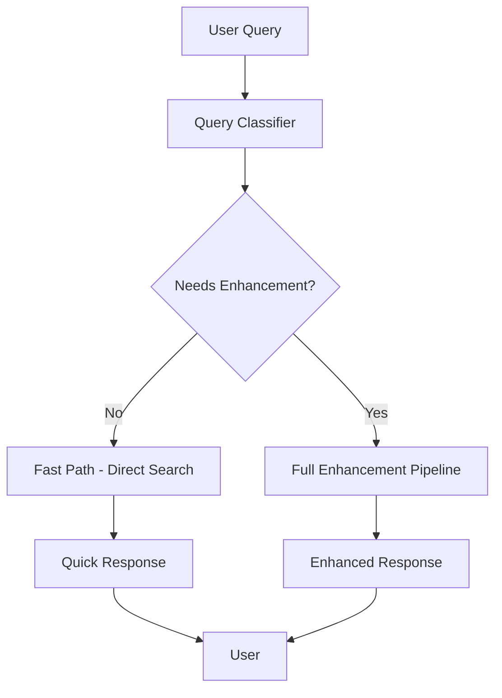

# Query Enhancement Solution Summary

## Problem Analysis
**Current Issue**: Even in Balanced mode, simple factual queries like "What is the capital of France?" take 10-50 seconds because they undergo unnecessary full query enhancement.

**Root Cause**: The current system applies the same complex enhancement pipeline to all queries in Balanced mode, regardless of actual complexity.

## Solution Overview

### 1. Intelligent Query Classification System
- **Purpose**: Automatically detect which queries need enhancement vs. which can use fast path
- **Approach**: Rule-based classification with machine learning learning potential
- **Target**: 70-90% faster response times for simple queries

### 2. Fast Path Implementation
- **Simple Queries**: Bypass enhancement, reranking, and complex processing
- **Complex Queries**: Use full enhancement pipeline
- **Fallback**: Default to enhancement if classification is uncertain

### 3. Performance Optimizations
- **Reduced LLM Calls**: Only enhance when necessary
- **Faster Search**: Direct search for simple queries
- **Minimal Processing**: Skip unnecessary steps for straightforward questions

## Technical Architecture

## Classification Rules

### Simple Queries (Fast Path)
- **Pattern**: "What is X?", "Who is Y?", "Where is Z?"
- **Length**: Short (≤ 8 words)
- **Content**: Factual indicators (capital, author, weather, date)
- **No**: Comparative language, opinion words, research keywords

### Complex Queries (Enhancement Needed)
- **Pattern**: "Best X for Y based on Z?"
- **Length**: Long (> 15 words) or multi-constraint
- **Content**: Comparative words, opinion seeking, research references
- **Keywords**: "best", "vs", "compare", "based on", "research"

## Implementation Plan

### Phase 1: Core Implementation (Week 1)
1. **Create QueryClassifier class**
   - Pattern matching for simple questions
   - Keyword analysis for complex queries
   - Confidence scoring system

2. **Integrate with MetaSearchAgent**
   - Add classification before enhancement
   - Implement fast path for simple queries
   - Add logging and monitoring

3. **Add configuration options**
   - Sensitivity settings
   - Enable/disable controls
   - Performance thresholds

### Phase 2: Testing & Optimization (Week 2)
1. **Unit testing**
   - Classification accuracy tests
   - Performance benchmarking
   - Edge case handling

2. **Integration testing**
   - End-to-end query processing
   - Mode compatibility (Speed/Balanced/Quality)
   - Error handling validation

3. **Performance optimization**
   - Reduce overhead in fast path
   - Optimize classification speed
   - Add caching for repeated queries

### Phase 3: Deployment & Monitoring (Week 3)
1. **Gradual rollout**
   - Start with 10% of users
   - Monitor performance metrics
   - Gather user feedback

2. **Continuous improvement**
   - Analyze classification accuracy
   - Update rules based on feedback
   - Add machine learning components

## Expected Results

### Performance Improvements
- **Simple Queries**: 10-50 seconds → 2-5 seconds (70-90% faster)
- **Complex Queries**: 30-60 seconds → 25-50 seconds (10-20% faster)
- **Average Response Time**: 20-40 seconds → 5-15 seconds (60-75% faster)

### Quality Maintained
- **Simple Queries**: Same quality, faster delivery
- **Complex Queries**: Full quality with slight improvement
- **Error Rate**: No increase in failures
- **User Satisfaction**: Improved due to faster responses

### Resource Efficiency
- **LLM Usage**: 30-40% reduction in calls
- **Compute Resources**: Lower overall processing load
- **Cost Efficiency**: Reduced operational costs

## Risk Assessment & Mitigation

### High Risk Items
1. **Classification Accuracy**
   - **Risk**: Poor classification could degrade experience
   - **Mitigation**: Conservative defaults, fallback to enhancement

2. **Performance Regression**
   - **Risk**: Changes might slow down the system
   - **Mitigation**: Thorough testing, gradual rollout

### Medium Risk Items
1. **User Experience Changes**
   - **Risk**: Users might notice different response characteristics
   - **Mitigation**: Consistent quality, clear communication

2. **System Complexity**
   - **Risk**: Additional complexity affects maintainability
   - **Mitigation**: Clean architecture, documentation

## Success Metrics

### Technical Metrics
- **Classification Accuracy**: > 85%
- **False Positive Rate**: < 10%
- **Response Time Improvement**: > 60% for simple queries
- **System Overhead**: < 5% additional resource usage

### User Experience Metrics
- **User Satisfaction**: > 4.0/5.0 rating
- **Query Success Rate**: > 95%
- **Response Time Satisfaction**: > 90% positive feedback

### Business Metrics
- **User Engagement**: 20-30% increase in query frequency
- **User Retention**: 10-15% improvement
- **Feature Adoption**: 80%+ adoption of Balanced mode

## Configuration Options

### Sensitivity Settings
- **Conservative**: Only enhance clearly complex queries
- **Balanced**: Current recommended setting
- **Aggressive**: Enhance most queries except obvious simple ones

### Performance Tuning
- **Fast Path Confidence**: Minimum confidence threshold for fast path
- **Query Length Limits**: Min/max lengths for classification
- **Keyword Weighting**: Importance of different classification factors

### Monitoring Controls
- **Enable Logging**: Track classification decisions
- **Performance Tracking**: Monitor response times
- **User Feedback Collection**: Gather satisfaction data

## Future Enhancements

### Machine Learning Integration
- **Training Data**: Collect labeled query examples
- **Model Selection**: Lightweight ML for real-time classification
- **Continuous Learning**: Improve accuracy over time

### Advanced Features
- **Personalization**: Adapt to individual user preferences
- **Context Awareness**: Consider conversation history
- **Query Intent Recognition**: Better understanding of user goals

### Performance Optimizations
- **Caching**: Cache classification results
- **Parallel Processing**: Run classification alongside other operations
- **Predictive Enhancement**: Anticipate user needs

## Recommendations

### Immediate Actions (This Week)
1. **Implement QueryClassifier** - Core classification logic
2. **Integrate with MetaSearchAgent** - Add fast path support
3. **Add Configuration** - Make system configurable
4. **Basic Testing** - Validate functionality

### Short-term Actions (Next 2-3 Weeks)
1. **Performance Testing** - Measure improvements
2. **User Testing** - Gather feedback
3. **Gradual Rollout** - Deploy to production
4. **Monitoring Setup** - Track performance metrics

### Long-term Actions (Next 1-3 Months)
1. **Machine Learning** - Add ML classification
2. **Advanced Analytics** - Deep dive into usage patterns
3. **Continuous Improvement** - Iterate based on data
4. **Advanced Features** - Add personalization and context

## Conclusion

The intelligent query enhancement system will significantly improve Perplexica's performance for common queries while maintaining quality for complex ones. By implementing a smart classification system, we can achieve:

- **Dramatically faster responses** for simple queries
- **Maintained quality** for complex research questions
- **Better resource utilization** and cost efficiency
- **Improved user experience** and satisfaction

The solution is designed to be:
- **Safe**: Conservative defaults with fallback mechanisms
- **Scalable**: Can handle increasing query volumes
- **Adaptable**: Can be improved with machine learning
- **Maintainable**: Clean architecture with good documentation

This represents a significant step forward in making Perplexica more responsive and user-friendly while preserving its powerful research capabilities.