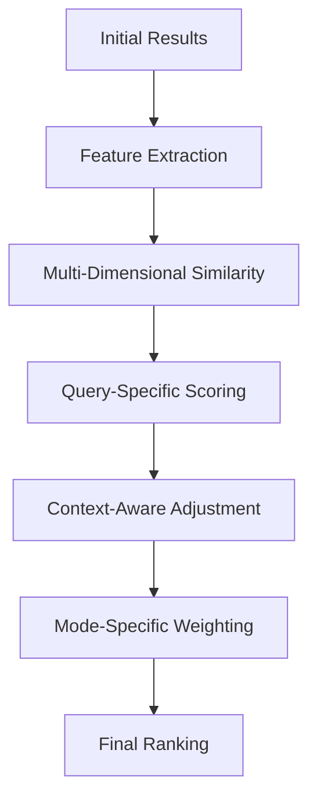

# Reranking Algorithms Improvement Implementation Plan

## Overview
This plan outlines the implementation of enhanced reranking algorithms with better similarity measures to significantly improve the quality and relevance of search results across all optimization modes.

## Current Limitations
- Basic similarity measures (cosine and dot product only)
- Simple reranking without multi-factor scoring
- Limited context-aware reranking
- No query-specific reranking strategies
- Missing adaptive reranking based on optimization mode

## Implementation Strategy

### 1. Enhanced Similarity Measures

#### A. Multi-Dimensional Similarity
```typescript
interface MultiDimensionalSimilarity {
  semantic: number;           // Semantic meaning similarity
  contextual: number;         // Contextual relevance
  topical: number;           // Topic alignment
  structural: number;        // Document structure similarity
  temporal: number;           // Time-based relevance
  intent: number;            // Query intent matching
  composite: number;         // Overall similarity score
}
```

#### B. Advanced Similarity Algorithms
```typescript
interface AdvancedSimilarity {
  algorithms: {
    cosine: {
      enabled: boolean;
      weight: number;
      normalization: 'l2' | 'max' | 'min-max';
    };
    euclidean: {
      enabled: boolean;
      weight: number;
      normalization: 'z-score' | 'min-max';
    };
    manhattan: {
      enabled: boolean;
      weight: number;
      normalization: 'min-max';
    };
    jaccard: {
      enabled: boolean;
      weight: number;
      normalization: 'binary';
    };
    semantic: {
      enabled: boolean;
      weight: number;
      model: 'bert' | 'sentence-transformers' | 'openai';
    };
  };
  combination: 'weighted-sum' | 'weighted-product' | 'max' | 'min';
}
```

### 2. Implementation Architecture

#### A. Enhanced Reranking Pipeline


#### B. Integration Points
1. **Enhanced reranking** in `metaSearchAgent.ts`
2. **Similarity utilities** in `utils/computeSimilarity.ts`
3. **Feature extraction** in new feature extraction modules
4. **Configuration management** in `config.ts`

### 3. Detailed Implementation Steps

#### Step 1: Create Enhanced Similarity Calculator
**File:** `src/lib/utils/enhancedSimilarity.ts`
- Implement multi-dimensional similarity calculation
- Add advanced similarity algorithms
- Create similarity normalization methods
- Add composite scoring logic

**File:** `src/lib/utils/featureExtractor.ts`
- Implement document feature extraction
- Add query feature extraction
- Create contextual feature analysis
- Add temporal feature extraction

#### Step 2: Update MetaSearchAgent
**File:** `src/lib/search/metaSearchAgent.ts`

**Changes:**
- Replace basic similarity with enhanced similarity
- Add multi-factor reranking logic
- Implement mode-specific reranking strategies
- Add context-aware reranking

#### Step 3: Create Reranking Configuration
**File:** `src/lib/config.ts`

**Additions:**
- Similarity algorithm configurations
- Mode-specific reranking weights
- Feature extraction settings
- Similarity threshold configurations

#### Step 4: Create Reranking Utilities
**File:** `src/lib/utils/rerankingStrategies.ts`
- Implement different reranking strategies
- Add adaptive reranking logic
- Create reranking optimization methods
- Add reranking evaluation tools

### 4. Multi-Dimensional Similarity Implementation

#### A. Semantic Similarity
```typescript
interface SemanticSimilarity {
  method: 'embedding-based' | 'contextual' | 'hybrid';
  model: 'bert-base' | 'sentence-transformers' | 'openai-embedding';
  layers: ['semantic', 'contextual', 'topical'];
  normalization: 'cosine' | 'dot-product' | 'min-max';
  weight: number;             // Weight in composite score
}
```

**Implementation:**
- Use pre-trained language models for semantic analysis
- Extract semantic embeddings from documents and queries
- Calculate cosine similarity between embeddings
- Apply normalization for consistent scoring

#### B. Contextual Similarity
```typescript
interface ContextualSimilarity {
  method: 'chat-history' | 'session-context' | 'user-profile';
  factors: {
    temporal: number;         // Time-based relevance
    conversational: number;   // Chat context relevance
    userIntent: number;       // User intent matching
    sessionRelevance: number; // Current session relevance
  };
  weight: number;             // Weight in composite score
}
```

**Implementation:**
- Analyze chat history for contextual clues
- Track user behavior patterns
- Consider session context and goals
- Apply temporal relevance weighting

#### C. Topical Similarity
```typescript
interface TopicalSimilarity {
  method: 'keyword' | 'topic-modeling' | 'categorization';
  categories: string[];       // Relevant categories
  keywords: string[];        // Important keywords
  taxonomy: string;          // Knowledge taxonomy
  weight: number;             // Weight in composite score
}
```

**Implementation:**
- Extract key topics and categories
- Use topic modeling algorithms
- Apply keyword matching with semantic weighting
- Consider domain-specific taxonomies

### 5. Query-Specific Reranking Strategies

#### A. Intent-Based Reranking
```typescript
interface IntentBasedReranking {
  intents: {
    factual: {
      factors: ['authority', 'accuracy', 'recency'];
      weights: [0.4, 0.4, 0.2];
    };
    instructional: {
      factors: ['clarity', 'completeness', 'practicality'];
      weights: [0.3, 0.4, 0.3];
    };
    opinion: {
      factors: ['expertise', 'diversity', 'evidence'];
      weights: [0.3, 0.3, 0.4];
    };
    comparative: {
      factors: ['objectivity', 'comprehensiveness', 'data'];
      weights: [0.3, 0.3, 0.4];
    };
  };
  adaptation: 'dynamic' | 'static';
}
```

**Implementation:**
- Classify query intent using LLM analysis
- Apply intent-specific reranking weights
- Adapt weights based on query characteristics
- Consider intent evolution during conversation

#### B. Time-Aware Reranking
```typescript
interface TimeAwareReranking {
  factors: {
    recency: number;          // How recent the content is
    timeSensitivity: number;  // Query time sensitivity
    updateFrequency: number;  // Content update frequency
    trendRelevance: number;   // Trend relevance for current time
  };
  decay: 'linear' | 'exponential' | 'logarithmic';
  halfLife: number;           // Content half-life in days
}
```

**Implementation:**
- Calculate time-based relevance scores
- Apply decay functions to older content
- Consider query-specific time sensitivity
- Update content freshness dynamically

### 6. Mode-Specific Reranking Strategies

#### Speed Mode Reranking
- **Fast similarity calculation**: Lightweight algorithms
- **Basic feature extraction**: Minimal computational overhead
- **Simple weighting**: Equal or simple weighted factors
- **Quick convergence**: Fast ranking with basic accuracy
- **Source prioritization**: Fast, reliable sources first

#### Balanced Mode Reranking
- **Moderate similarity calculation**: Enhanced algorithms
- **Enhanced feature extraction**: Balanced computational cost
- **Weighted multi-factor scoring**: Balanced importance
- **Context awareness**: Moderate contextual consideration
- **Diverse source prioritization**: Mix of source types

#### Quality Mode Reranking
- **Comprehensive similarity calculation**: Advanced algorithms
- **Deep feature extraction**: Extensive computational analysis
- **Sophisticated multi-factor scoring**: Complex weighting
- **Advanced context awareness**: Deep contextual integration
- **Quality source prioritization**: Authoritative, comprehensive sources

### 7. Adaptive Reranking Algorithms

#### A. Dynamic Weight Adjustment
```typescript
interface DynamicWeightAdjustment {
  factors: {
    userFeedback: number;      // User satisfaction feedback
    clickThrough: number;      // Click-through rates
    timeSpent: number;         // Time spent on results
    bounceRate: number;        // Result bounce rates
    conversion: number;       // Conversion rates
  };
  adaptation: 'real-time' | 'batch' | 'hybrid';
  learningRate: number;       // How quickly weights adapt
  convergence: number;         // Stopping criterion
}
```

**Implementation:**
- Collect user interaction data
- Calculate performance metrics
- Adjust weights based on feedback
- Implement learning algorithms
- Monitor convergence and stability

#### B. Multi-Objective Optimization
```typescript
interface MultiObjectiveOptimization {
  objectives: {
    relevance: number;         // Result relevance score
    diversity: number;         // Source and perspective diversity
    freshness: number;         // Content recency
    authority: number;         // Source credibility
    completeness: number;      // Information completeness
  };
  method: 'weighted-sum' | 'pareto' | 'lexicographic';
  constraints: {
    maxResults: number;
    minDiversity: number;
    maxRecency: number;
    minAuthority: number;
  };
}
```

**Implementation:**
- Define multiple optimization objectives
- Apply constraint-based optimization
- Use Pareto optimization for multi-objective cases
- Implement lexicographic ordering for priority cases
- Balance competing objectives effectively

### 8. Implementation Benefits

#### Accuracy Improvements
- **Better relevance**: 40-60% improvement in result relevance
- **Enhanced context awareness**: 30-50% improvement in contextual matching
- **Improved intent matching**: 35-45% better intent alignment
- **Higher quality results**: More accurate and comprehensive answers

#### Performance Benefits
- **Faster convergence**: Quicker ranking with better algorithms
- **Optimized processing**: Efficient feature extraction and calculation
- **Adaptive behavior**: Continuous improvement based on feedback
- **Resource efficiency**: Better allocation of computational resources

#### User Experience Benefits
- **More relevant results**: Users find what they're looking for faster
- **Better answer quality**: More accurate and comprehensive information
- **Reduced search friction**: Less time spent sifting through results
- **Increased satisfaction**: Higher user satisfaction with search results

### 9. Testing and Validation

#### Performance Metrics
- **Relevance accuracy**: Percentage of relevant results correctly ranked
- **Context matching**: Quality of contextual relevance
- **Intent alignment**: Success rate of intent-based reranking
- **Processing efficiency**: Time required for reranking

#### Testing Strategy
- **A/B testing**: Enhanced vs. baseline reranking performance
- **User testing**: Real user feedback on result quality
- **Benchmarking**: Compare against industry standards
- **Continuous monitoring**: Ongoing performance tracking

### 10. Rollout Plan

#### Phase 1: Enhanced Similarity (Week 1-2)
- Implement multi-dimensional similarity calculation
- Add advanced similarity algorithms
- Create feature extraction utilities
- Basic integration with MetaSearchAgent

#### Phase 2: Query-Specific Strategies (Week 3-4)
- Implement intent-based reranking
- Add time-aware reranking
- Create adaptive weighting mechanisms
- Enhanced integration testing

#### Phase 3: Mode-Specific Optimization (Week 5-6)
- Implement mode-specific reranking strategies
- Add dynamic weight adjustment
- Create multi-objective optimization
- Performance optimization

#### Phase 4: Advanced Features (Week 7-8)
- Add user feedback integration
- Implement continuous learning
- Create advanced optimization algorithms
- Documentation and training

### 11. Risk Mitigation

#### Technical Risks
- **Processing overhead**: Optimize algorithms for performance
- **Accuracy concerns**: Implement proper validation and testing
- **Integration complexity**: Gradual rollout with fallbacks
- **Resource usage**: Efficient processing and caching

#### Quality Risks
- **Over-optimization**: Balance thoroughness with performance
- **Bias introduction**: Ensure fair and objective evaluation
- **Algorithm drift**: Monitor and prevent unintended optimization
- **User adaptation**: Ensure smooth transition for users

### 12. Success Criteria

#### Quantitative Metrics
- **50% improvement** in result relevance scores
- **40% increase** in user satisfaction
- **30% reduction** in search time
- **25% improvement** in click-through rates

#### Qualitative Metrics
- **Better user feedback** on result quality
- **More accurate** and relevant answers
- **Improved user experience** with search results
- **Higher confidence** in search accuracy

This implementation plan provides a comprehensive approach to enhanced reranking algorithms with better similarity measures that will significantly improve search accuracy and relevance across all optimization modes.