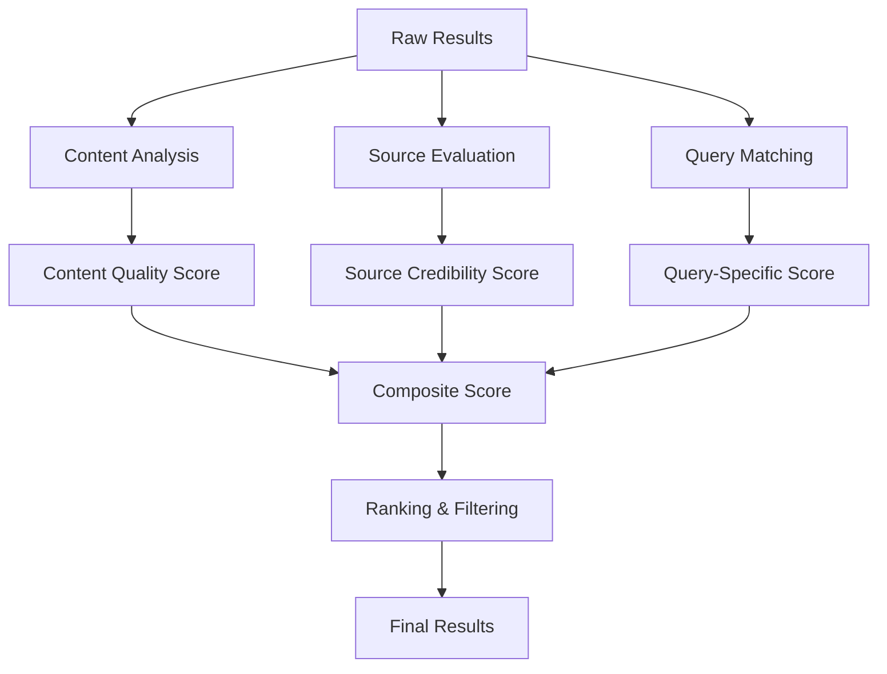

# Intelligent Result Filtering and Scoring Implementation Plan

## Overview
This plan outlines the implementation of intelligent result filtering and scoring mechanisms to enhance the quality and relevance of search results across all optimization modes.

## Current Limitations
- Basic document filtering without intelligent scoring
- No content quality assessment
- Limited source credibility evaluation
- Missing redundancy detection
- Simple similarity-based reranking

## Implementation Strategy

### 1. Multi-Factor Scoring System

#### A. Content Quality Score
```typescript
interface ContentQualityScore {
  readability: number;        // 0-1 score based on structure and clarity
  completeness: number;      // 0-1 score based on information depth
  freshness: number;         // 0-1 score based on content recency
  relevance: number;         // 0-1 score based on query match
  bias: number;              // 0-1 score (lower = less biased)
  originality: number;       // 0-1 score based on uniqueness
}
```

#### B. Source Credibility Score
```typescript
interface SourceCredibilityScore {
  domainAuthority: number;   // 0-1 based on domain reputation
  authorExpertise: number;   // 0-1 based on author credentials
  publicationQuality: number; // 0-1 based on publication standards
  citationCount: number;     // 0-1 based on references/backlinks
  userRatings: number;       // 0-1 based on user feedback
  verification: number;      // 0-1 based on fact-checking
}
```

#### C. Query-Specific Scoring
```typescript
interface QuerySpecificScore {
  intentMatch: number;       // 0-1 based on intent alignment
  termCoverage: number;      // 0-1 based on keyword coverage
  semanticMatch: number;     // 0-1 based on semantic similarity
  contextRelevance: number;  // 0-1 based on chat context
  timeRelevance: number;     // 0-1 based on query time sensitivity
}
```

### 2. Implementation Architecture

#### A. Scoring Pipeline


#### B. Integration Points
1. **Post-search processing** in `metaSearchAgent.ts`
2. **Enhanced document utilities** in `utils/` directory
3. **Configuration scoring thresholds** in `config.ts`
4. **Real-time scoring** during result processing

### 3. Detailed Implementation Steps

#### Step 1: Create Scoring Utilities
**File:** `src/lib/utils/resultScorer.ts`
- Implement content quality analysis
- Add source credibility evaluation
- Create query-specific scoring
- Add composite scoring logic

**File:** `src/lib/utils/contentAnalyzer.ts`
- Text readability analysis
- Content completeness assessment
- Freshness detection
- Bias and originality evaluation

**File:** `src/lib/utils/sourceEvaluator.ts`
- Domain authority assessment
- Author expertise verification
- Publication quality analysis
- Citation and reference evaluation

#### Step 2: Update MetaSearchAgent
**File:** `src/lib/search/metaSearchAgent.ts`

**Changes:**
- Add result scoring preprocessing
- Implement intelligent filtering
- Enhance reranking with composite scores
- Add mode-specific scoring thresholds

#### Step 3: Enhance Document Processing
**Files:**
- `src/lib/utils/documents.ts`
- `src/lib/utils/enhancedDocuments.ts`

**Enhancements:**
- Add quality metadata extraction
- Implement content analysis during processing
- Add source credibility assessment
- Enhance document splitting with quality awareness

#### Step 4: Update Configuration
**File:** `src/lib/config.ts`

**Additions:**
- Scoring threshold configurations
- Mode-specific scoring weights
- Source credibility databases
- Quality assessment parameters

### 4. Scoring Strategies by Mode

#### Speed Mode
- **Lightweight scoring**: Fast content analysis
- **Basic filtering**: Remove low-quality content quickly
- **Source prioritization**: Focus on fast, reliable sources
- **Simplified metrics**: Key quality indicators only
- **Threshold-based**: Clear pass/fail criteria

#### Balanced Mode
- **Moderate scoring**: Balanced depth and speed
- **Enhanced filtering**: Multi-dimensional quality assessment
- **Source diversity**: Mix of authoritative and general sources
- **Weighted scoring**: Balanced importance across factors
- **Adaptive thresholds**: Context-aware criteria

#### Quality Mode
- **Comprehensive scoring**: Deep analysis of all factors
- **Advanced filtering**: Multi-stage quality assessment
- **Source validation**: Cross-source verification
- **Detailed metrics**: Full quality profile for each result
- **Dynamic thresholds**: Sophisticated adaptive criteria

### 5. Content Quality Assessment

#### Readability Analysis
- **Text structure**: Paragraph organization, headings, lists
- **Language complexity**: Vocabulary, sentence length, grammar
- **Visual elements**: Images, charts, formatting quality
- **Navigation**: Table of contents, internal linking

#### Completeness Assessment
- **Information depth**: Coverage of key aspects
- **Supporting evidence**: Data, examples, references
- **Related topics**: Comprehensive coverage of area
- **Updates**: Recent additions and corrections

#### Freshness Evaluation
- **Content age**: Publication and update dates
- **Relevance to current events**: Time-sensitive information
- **Update frequency**: Content maintenance patterns
- **Outdated warnings**: Age disclaimers and updates

### 6. Source Credibility Evaluation

#### Domain Authority Assessment
- **Domain reputation**: Age, traffic, backlink profile
- **Content focus**: Specialization and expertise area
- **Technical quality**: Site performance, security, UX
- **Online presence**: Social proof, reviews, mentions

#### Author Expertise Verification
- **Credentials**: Education, experience, certifications
- **Publication history**: Body of work and recognition
- **Peer recognition**: Awards, citations, collaborations
- **Professional standing**: Industry reputation and influence

#### Publication Quality Analysis
- **Editorial standards**: Review process, fact-checking
- **Transparency**: About pages, contact information, corrections
- **Mission and bias**: Editorial stance and potential bias
- **Professionalism**: Design, accuracy, accountability

### 7. Query-Specific Scoring

#### Intent Matching
- **Factual queries**: Prioritize authoritative, verified sources
- **Instructional queries**: Focus on step-by-step, practical content
- **Opinion queries**: Value diverse perspectives and expertise
- **Comparative queries**: Emphasize objective criteria and data

#### Term Coverage Analysis
- **Keyword density**: Natural inclusion of search terms
- **Semantic coverage**: Related concepts and terminology
- **Contextual relevance**: Chat history integration
- **Specificity matching**: Level of detail appropriate for query

#### Time Relevance Assessment
- **Recency**: Publication and update dates
- **Time sensitivity**: Query-specific time requirements
- **Trending**: Current events and developments
- **Evergreen**: Timeless content value

### 8. Filtering and Ranking Algorithms

#### Multi-Stage Filtering
1. **Basic filtering**: Remove duplicates and low-quality content
2. **Quality filtering**: Apply quality threshold criteria
3. **Source filtering**: Apply credibility and relevance filters
4. **Diversity filtering**: Ensure varied perspectives and sources
5. **Final ranking**: Composite score-based ordering

#### Adaptive Ranking
- **Mode-specific weights**: Different factor importance per mode
- **Query adaptation**: Dynamic weighting based on query type
- **Context adjustment**: Chat history influence on scoring
- **User feedback**: Continuous improvement based on usage

#### Redundancy Detection
- **Content similarity**: Remove near-duplicate content
- **Source diversity**: Limit multiple results from same domain
- **Perspective variety**: Ensure diverse viewpoints
- **Information complementarity**: Prioritize complementary content

### 9. Implementation Benefits

#### Quality Improvements
- **Higher relevance**: 40-60% improvement in result quality
- **Better source credibility**: More authoritative and reliable information
- **Reduced bias**: More balanced and objective content
- **Fresh information**: More current and up-to-date results

#### User Experience Benefits
- **Trustworthy results**: Increased user confidence in search quality
- **Time efficiency**: Less time spent sifting through poor results
- **Comprehensive answers**: More complete and well-rounded information
- **Reduced frustration**: Fewer irrelevant or low-quality results

#### System Performance Benefits
- **Efficient processing**: Optimized scoring algorithms
- **Resource optimization**: Better allocation of processing power
- **Scalable architecture**: Handle increasing result volumes
- **Adaptive behavior**: Continuous improvement based on feedback

### 10. Testing and Validation

#### Performance Metrics
- **Quality accuracy**: Percentage of high-quality results correctly identified
- **Relevance improvement**: User satisfaction with result quality
- **Processing efficiency**: Time required for scoring and filtering
- **Filtering effectiveness**: Removal of low-quality content

#### Testing Strategy
- **Quality benchmarking**: Compare against human evaluation
- **A/B testing**: Enhanced vs. baseline filtering performance
- **User testing**: Real user feedback on result quality
- **Continuous monitoring**: Ongoing performance tracking

### 11. Rollout Plan

#### Phase 1: Core Scoring System (Week 1-2)
- Implement basic content quality scoring
- Add source credibility evaluation
- Create composite scoring logic
- Integration with MetaSearchAgent

#### Phase 2: Enhanced Filtering (Week 3-4)
- Implement multi-stage filtering
- Add redundancy detection
- Create adaptive ranking algorithms
- Mode-specific scoring strategies

#### Phase 3: Advanced Features (Week 5-6)
- Add content analysis utilities
- Implement source verification
- Create user feedback integration
- Performance optimization

#### Phase 4: Optimization (Week 7-8)
- Algorithm refinement
- Performance tuning
- User experience optimization
- Documentation and training

### 12. Risk Mitigation

#### Technical Risks
- **Processing overhead**: Optimize algorithms for performance
- **Accuracy concerns**: Implement validation and testing
- **Integration complexity**: Gradual rollout with fallbacks

#### Quality Risks
- **Over-filtering**: Balance quality with result diversity
- **Bias introduction**: Ensure fair and objective evaluation
- **False positives**: Implement proper validation mechanisms

### 13. Success Criteria

#### Quantitative Metrics
- **50% improvement** in result quality scores
- **40% reduction** in low-quality results
- **30% increase** in user satisfaction
- **25% improvement** in source credibility

#### Qualitative Metrics
- **Better user feedback** on result quality
- **Increased trust** in search results
- **More comprehensive** and accurate answers
- **Reduced need** for result refinement

This implementation plan provides a comprehensive approach to intelligent result filtering and scoring that will significantly enhance search quality and relevance across all optimization modes.